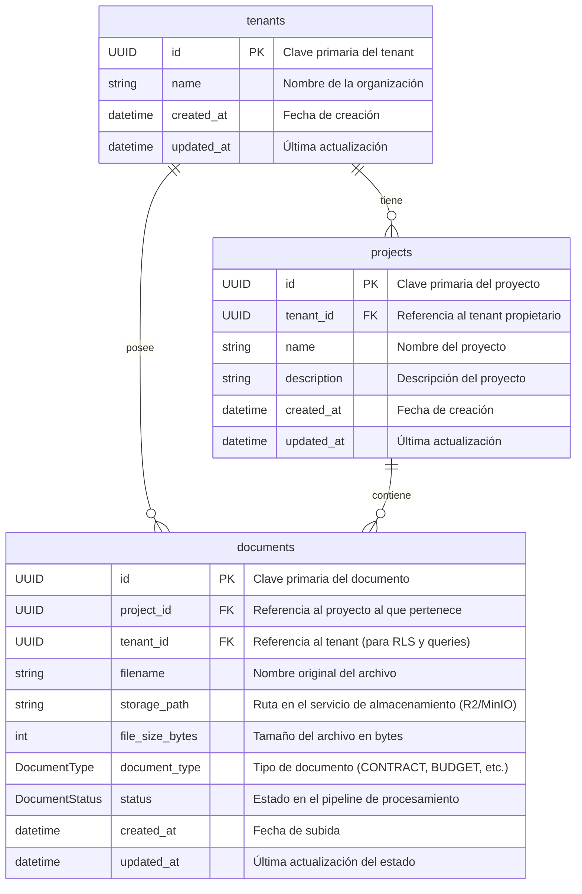

# Diagrama de Base de Datos (C2Pro)

**Última Actualización:** 2026-01-13

Este documento contiene el diagrama de Entidad-Relación (ERD) para la base de datos de C2Pro. El diagrama se mantiene utilizando la sintaxis de [Mermaid.js](https://mermaid.js.org/).

## Diagrama ERD

## Relaciones Clave

- **`tenants` a `projects`**: Un tenant puede tener múltiples proyectos. La relación `tenants.id` -> `projects.tenant_id` es fundamental para el aislamiento de datos (Row Level Security).
- **`projects` a `documents`**: Un proyecto puede contener múltiples documentos. La relación `projects.id` -> `documents.project_id` organiza los documentos por proyecto.
- **`tenants` a `documents`**: Se mantiene una referencia directa `documents.tenant_id` para optimizar las políticas de RLS y las consultas, evitando un JOIN adicional a la tabla `projects` en cada acceso a un documento.

---
*Este diagrama se genera y actualiza como parte del flujo de trabajo de documentación automatizada.*