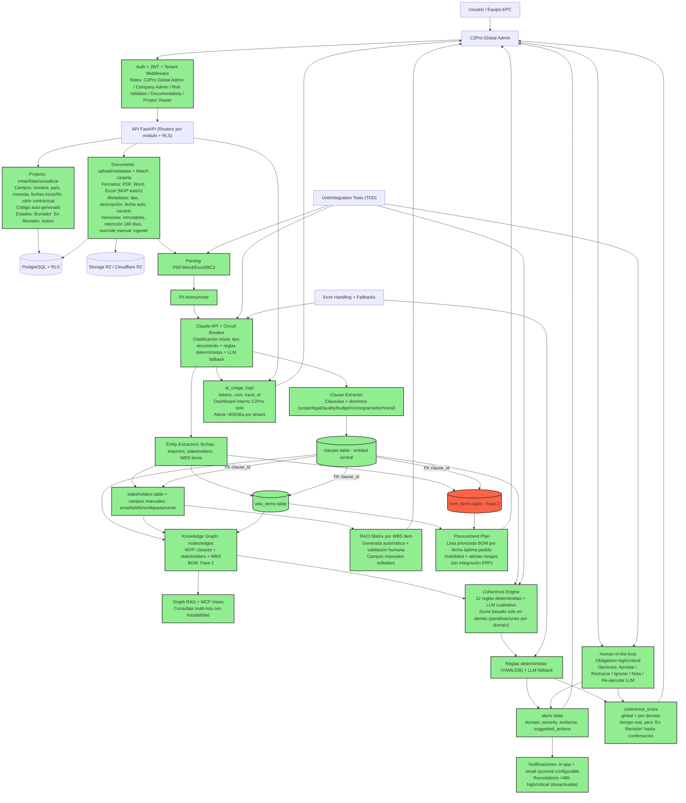

# C2Pro - Diagrama de Flujo del Proyecto (Mermaid)

Este documento concentra el **flujo funcional del negocio** (casos de uso) en un solo diagrama Mermaid y un índice de flujos detallados para mantener contexto LLM.

## Indice de flujos

1. F1 - Onboarding y seguridad multi-tenant (Auth + RLS)
2. F2 - Creacion y gestion de proyectos
3. F3 - Ingesta de documentos (upload + storage)
4. F4 - Parsing y extraccion IA (clausulas, entidades)
5. F5 - Trazabilidad legal (clauses + FKs)
6. F6 - Knowledge Graph + Graph RAG
7. F7 - Coherence Engine (reglas deterministas + LLM)
8. F8 - Alertas y scoring (Coherence Score)
9. F9 - Stakeholder Intelligence + RACI
10. F10 - Procurement (WBS/BOM + plan de compras)
11. F11 - Human-in-the-loop (validacion y resolucion)
12. F12 - Observabilidad y costos IA

---

## Diagrama general (Mermaid)

---

## F1 - Onboarding y seguridad multi-tenant (Auth + RLS)

**Objetivo:** aislar datos por tenant y habilitar acceso seguro.

- Entrada: alta de usuarios y login (JWT con tenant_id).
- Proceso: roles por nivel (C2Pro Global Admin multi-tenant, Company Admin, Risk Validator, Documentalista, Project Viewer) + permisos; middleware extrae tenant_id y aplica filtros.
- Salida: acceso por rol y tenant; Risk Validator puede cerrar alertas high/critical sin Company Admin; C2Pro Global Admin con alcance de soporte/operaciones.

---

## F2 - Creacion y gestion de proyectos

**Objetivo:** representar el proyecto EPC como entidad core.

- Entrada: datos de proyecto (por C2Pro Global Admin o Company Admin).
- Proceso: CRUD via Projects module con permisos por rol; Company Admin crea sin aprobacion, con posibilidad futura de validacion C2Pro por capacidad/volumen; Risk Validator puede editar/cerrar y gestionar estado "En Revision".
- Salida: project_id usado por documentos, analisis y procurement.

---

## F3 - Ingesta de documentos (upload + storage)

**Objetivo:** subir contrato, cronograma, presupuesto.

- Entrada: archivos PDF/Excel/Word/BC3 (y futuros formatos de cronograma).
- Proceso: upload, metadata y persistencia; watch por proyecto (carpeta sincronizada) con confirmacion de conflictos de version; subida permitida para Risk Validator y Documentalista.
- Salida: documento almacenado y listo para parsing.

---

## F4 - Parsing y extraccion IA (clausulas, entidades)

**Objetivo:** transformar documentos en datos estructurados.

- Entrada: documento almacenado.
- Proceso: parsing + anonymizer + LLM extraction; validacion humana posterior; revision automatica por umbral de confianza (numerico) y reglas por tipo de dato; parsing estructurado (Excel/BC3) prioriza validaciones deterministas y usa LLM solo si falta contexto.
- Salida: clausulas, entidades, estructuras.

---

## F5 - Trazabilidad legal (clauses + FKs)

**Objetivo:** asegurar evidencia trazable por clausula.

- Entrada: clausulas extraidas.
- Proceso: guardar clauses y relacionar FKs; separar trazabilidad legal, WBS/BOM y stakeholders.
- Salida: stakeholders/WBS/BOM/alerts con clause_id y trazabilidad por dominio; cualquier alerta debe tener clause_id o evidencia alternativa obligatoria.

---

## F6 - Knowledge Graph + Graph RAG

**Objetivo:** conectar entidades para consultas y evidencia.

- Entrada: clausulas + entidades.
- Proceso: nodos/edges + vistas MCP allowlist; RAG solo usa vistas allowlist y respeta RLS; politicas de redaccion/anonimizacion antes de respuestas.
- Salida: grafo navegable y RAG con trazabilidad.

---

## F7 - Coherence Engine (reglas deterministas + LLM)

**Objetivo:** detectar incoherencias entre documentos.

- Entrada: clausulas + entidades + grafo.
- Proceso: reglas deterministas y evaluadores LLM con umbrales de confianza y validacion humana para alertas criticas; versionado y auditoria de reglas.
- Salida: alertas y score de coherencia; cada alerta guarda rule_id, version, inputs y evidencias.

---

## F8 - Alertas y scoring (Coherence Score)

**Objetivo:** priorizar riesgos y cuantificar impacto.

- Entrada: resultados del motor de coherencia.
- Proceso: severidad, evidencia, scoring 0-100; clasificacion por dominios (scope, legal, quality, budget, cronograma, technical); score puede quedar "En Revision" hasta validacion humana; alertas high/critical bloquean estado "Activo" hasta revision.
- Salida: alertas en UI y score agregado por proyecto por dominio cuando hay datos suficientes.

---

## F9 - Stakeholder Intelligence + RACI

**Objetivo:** mapear stakeholders y responsabilidades.

- Entrada: menciones en clausulas/documentos.
- Proceso: clasificacion + matriz RACI; stakeholders creados por extraccion y manualmente.
- Salida: mapa de stakeholders y RACI en UI; en fase 2, alertas/acciones y recordatorios directos por stakeholder.

---

## F10 - Procurement (WBS/BOM + plan de compras)

**Objetivo:** conectar contrato con compras y materiales.

- Entrada: WBS y BOM generados (BOM puede ser manual y por IA).
- Proceso: versionado y plan de compras; validacion por Risk Validator.
- Salida: visibilidad de procurement y riesgos; fase 2; alertas de procurement se clasifican con los mismos criterios de coherence (costes, plazos, calidad) aplicados a compras.

---

## F11 - Human-in-the-loop (validacion y resolucion)

**Objetivo:** validacion humana obligatoria en outputs criticos.

- Entrada: alertas y findings.
- Proceso: revision, aprobacion, notas; aprobacion/rechazo por Risk Validator; sin SLA definido.
- Salida: alertas resueltas y score recalculado; feedback al sistema.

---

## F12 - Observabilidad y costos IA

**Objetivo:** trazabilidad de uso, costos y seguridad.

- Entrada: llamadas a LLM y eventos API.
- Proceso: logging estructurado + ai_usage_logs.
- Salida: dashboard de uso, costos y anomalias; foco interno C2Pro en fase actual; en fase 2, posible vista basica para cliente; limites/circuit breaker por tenant para evitar sobrecoste de APIs (gestion C2Pro).
