# C2Pro — Flow Diagrams (Post-Reorganization)

**Date:** 2026-02-24
**Status:** Current (reflects code after Phases 1–5)
**Reference:** ADR-006, `DEMO_VS_PROD_CONTRACT.md`

> These diagrams supersede all pre-reorganization diagrams found in
> `docs/audits/STRATEGIC_ARCHITECTURE_AUDIT_2026-02-19.md` and
> `docs/audits/PHASE1_*.md`. Those files remain as historical records.

---

## 1. Application Initialization

### 1.1 Provider Tree & MSW Gate

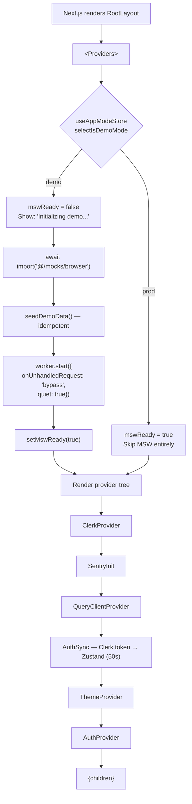

### 1.2 Server-Side MSW (instrumentation.ts)

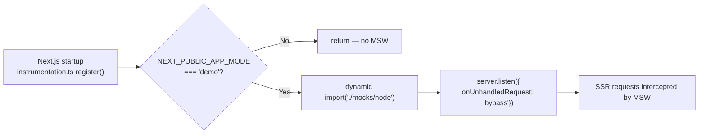

---

## 2. Authentication Flow

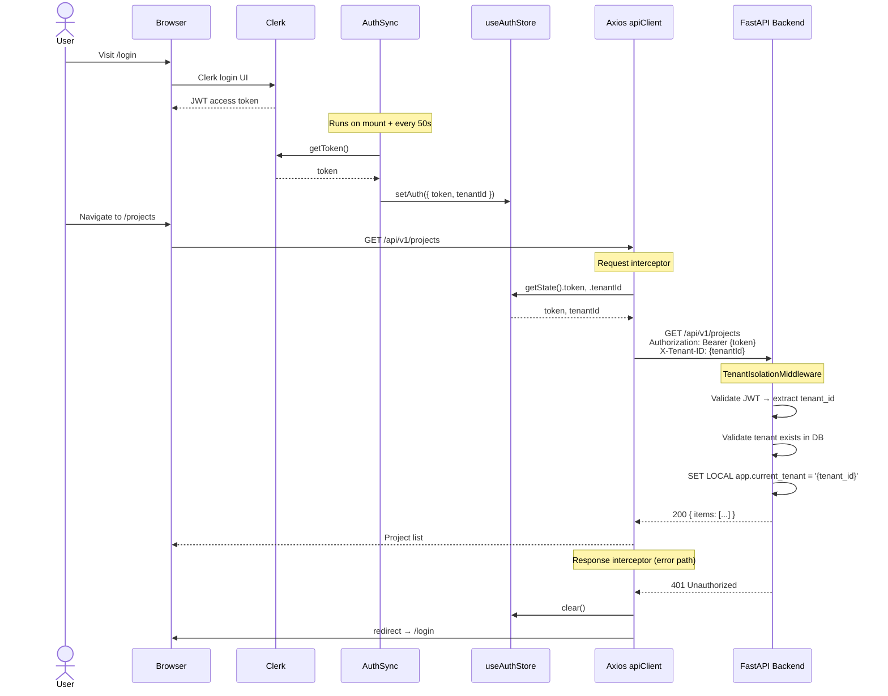

---

## 3. Data Flow — Page Patterns

### 3.1 Server Component Pattern (e.g., Dashboard, Documents, Coherence)

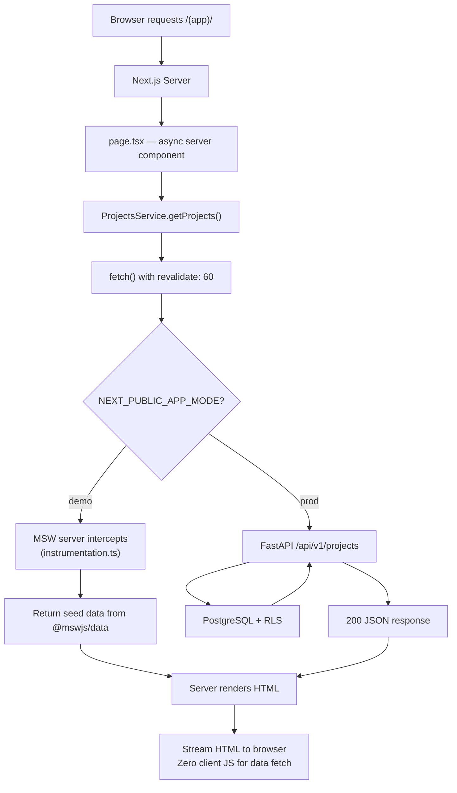

### 3.2 Client Component Pattern (e.g., Alerts, Stakeholders, RACI)

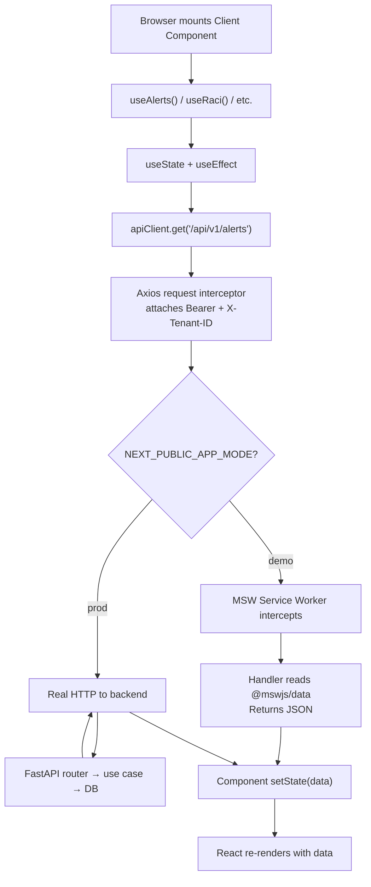

### 3.3 React Query Pattern (e.g., Projects list with caching)

```mermaid
flowchart TD
    A["Component mounts"] --> B["useProjects()"]
    B --> C["useQuery({ queryKey: ['projects'],<br/>queryFn: ProjectsService.getProjects })"]
    C --> D{"Cache fresh?<br/>(staleTime: 5min)"}
    D -- Yes --> E["Return cached data<br/>No network request"]
    D -- No --> F["ProjectsService.getProjects()"]
    F --> G["apiClient.get('/projects')"]
    G --> H["Network → MSW or Backend"]
    H --> I["Update cache + return data"]
    I --> J["Component renders"]
    E --> J

    Note over C: Background refetch<br/>on window focus
```

---

## 4. Demo vs Production Mode

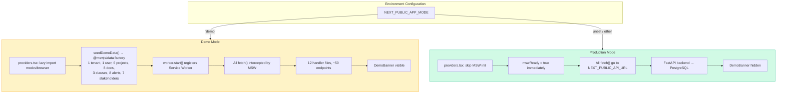

---

## 5. Backend Request Pipeline

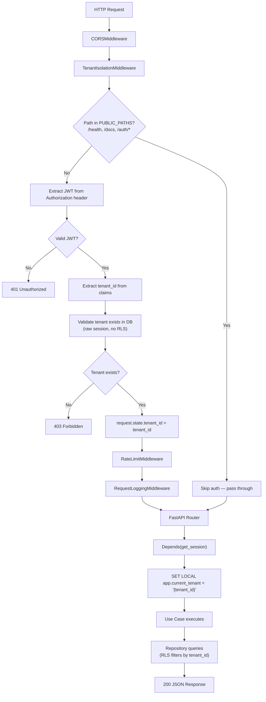

---

## 6. Multi-Tenancy (5 Layers)

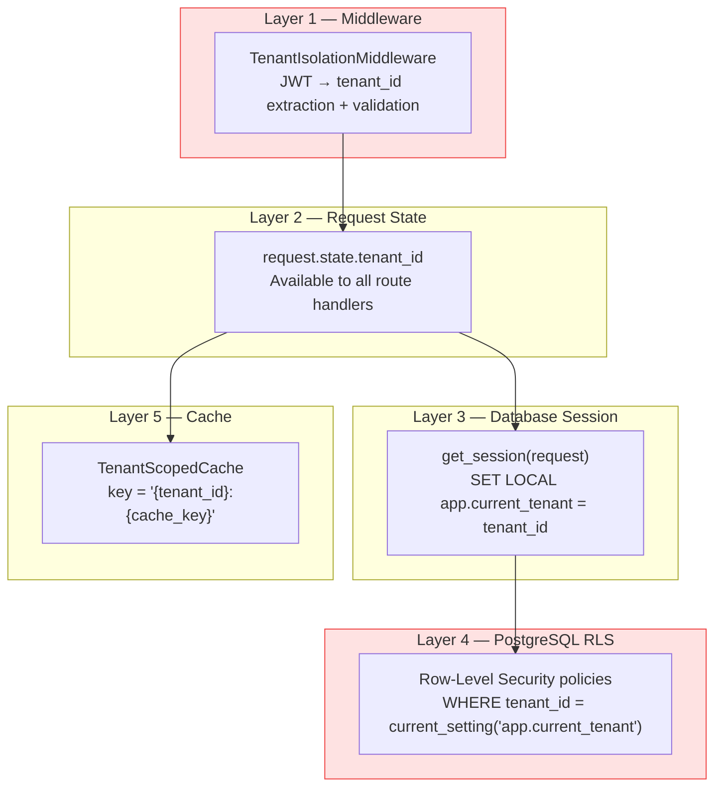

---

## 7. Module Architecture (Hexagonal Pattern)

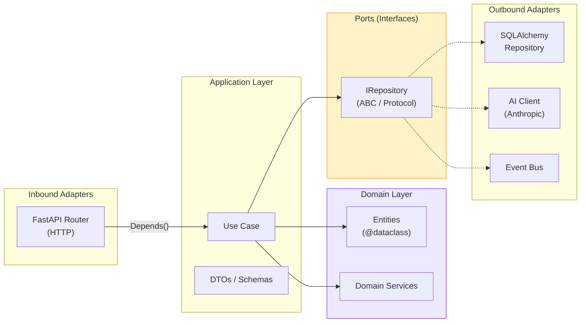

---

## 8. Bounded Context Map

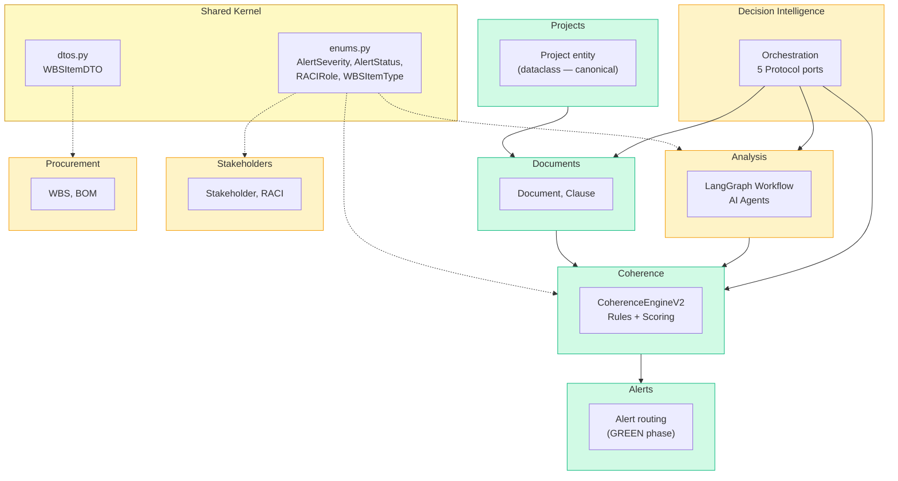

**Legend:** Green = router active in `main.py` | Yellow = router exists but commented out

---

## 9. LangGraph Workflow (Analysis)

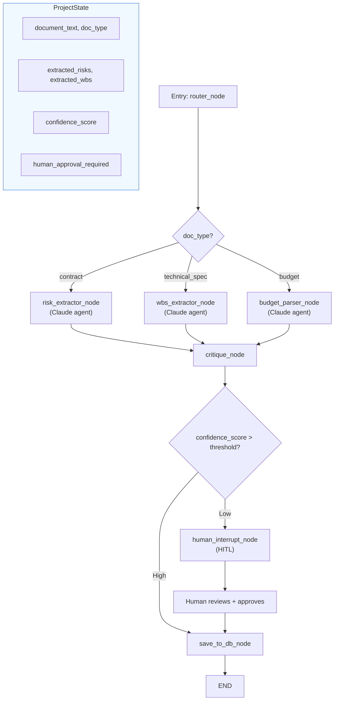

**Checkpointing:** PostgreSQL via `AsyncPostgresSaver` — flows are resumable across requests.

---

## 10. Frontend Component Tree (App Layout)

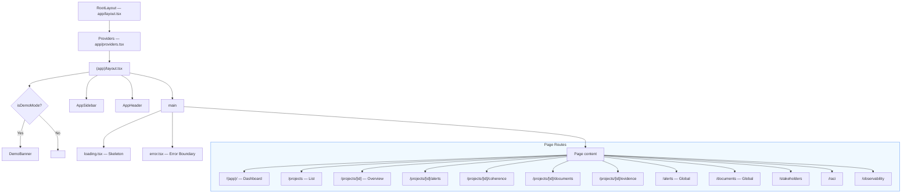

---

## 11. MSW Handler Registration

```mermaid
flowchart LR
    subgraph handlers["mocks/handlers/index.ts"]
        H1["healthHandler (1)"]
        H2["demoDataHandlers (16)"]
        H3["alertReviewHandlers (9)"]
        H4["uploadHandlers (3)"]
        H5["processingStreamHandler (1)"]
        H6["cookieConsentHandlers (3)"]
        H7["legalDisclaimerHandlers (2)"]
        H8["onboardingSampleProjectHandlers (4)"]
        H9["s312A11yResponsiveHandlers (5)"]
        H10["documentViewerHandlers (2)"]
        H11["observabilityHandlers (2)"]
        H12["raciHandlers (2)"]
    end

    subgraph browser["mocks/browser.ts"]
        B1["seedDemoData()"]
        B2["setupWorker(...handlers)"]
    end

    subgraph data["mocks/data/"]
        D1["db.ts — @mswjs/data factory"]
        D2["seed.ts — seedDemoData()"]
    end

    D2 --> D1
    B1 --> D2
    handlers --> B2

    style handlers fill:#fef9c3,stroke:#ca8a04
    style data fill:#ede9fe,stroke:#7c3aed
```

---

## 12. Endpoint Parity (Frontend ↔ Backend)

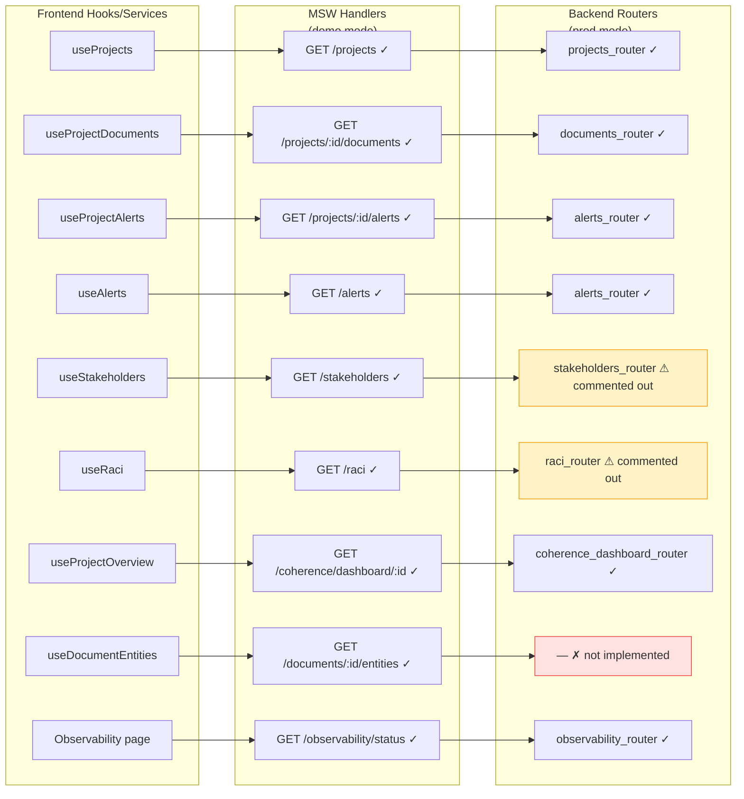

**Legend:** Green = fully implemented | Yellow = router exists, not wired | Red = MSW-only
