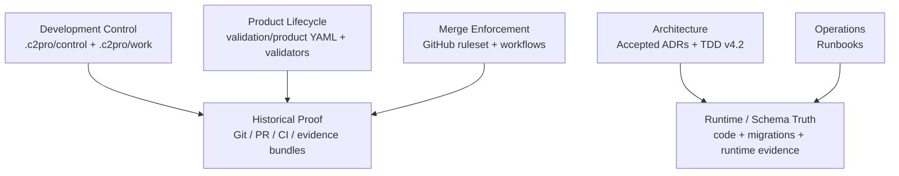
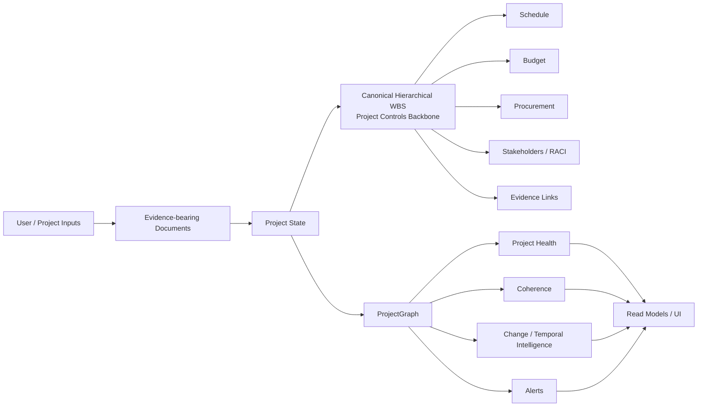
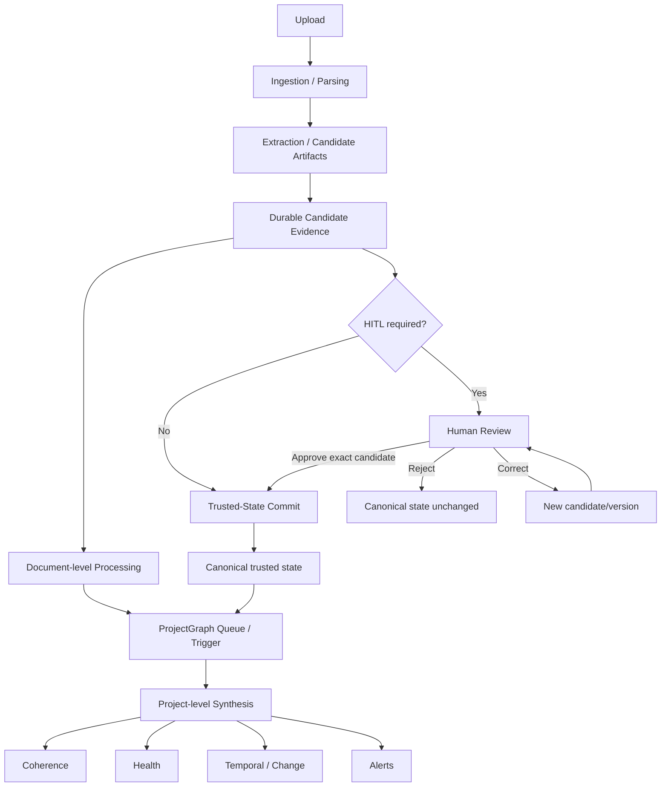
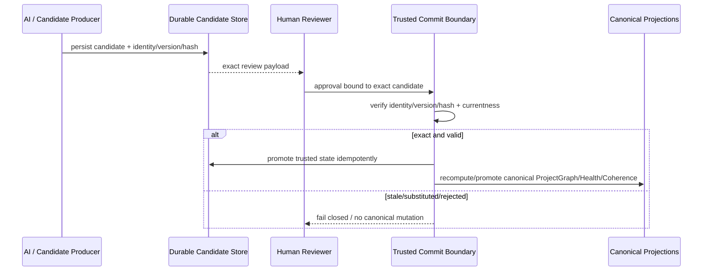
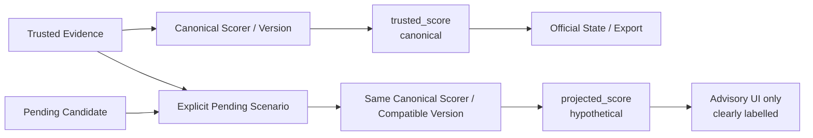
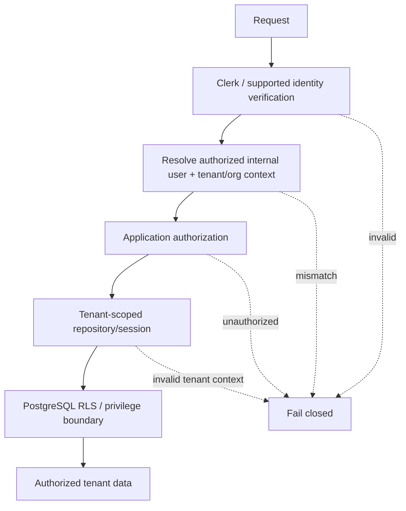
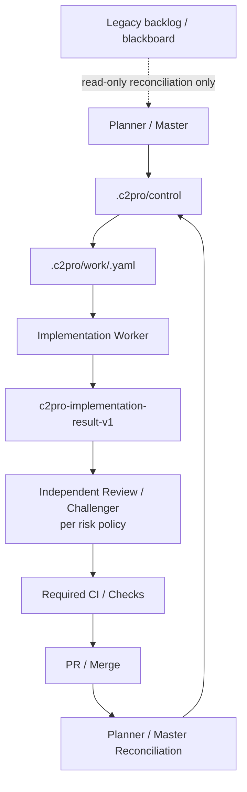
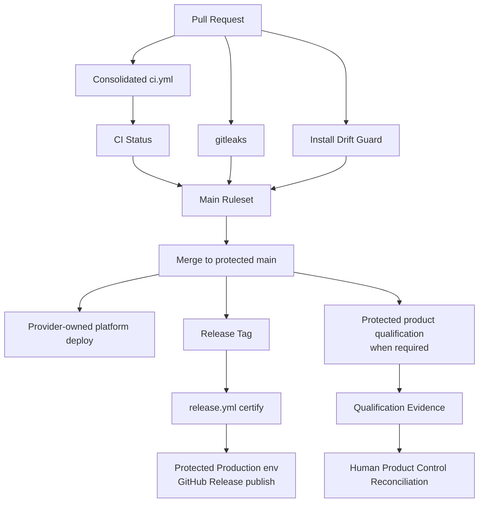
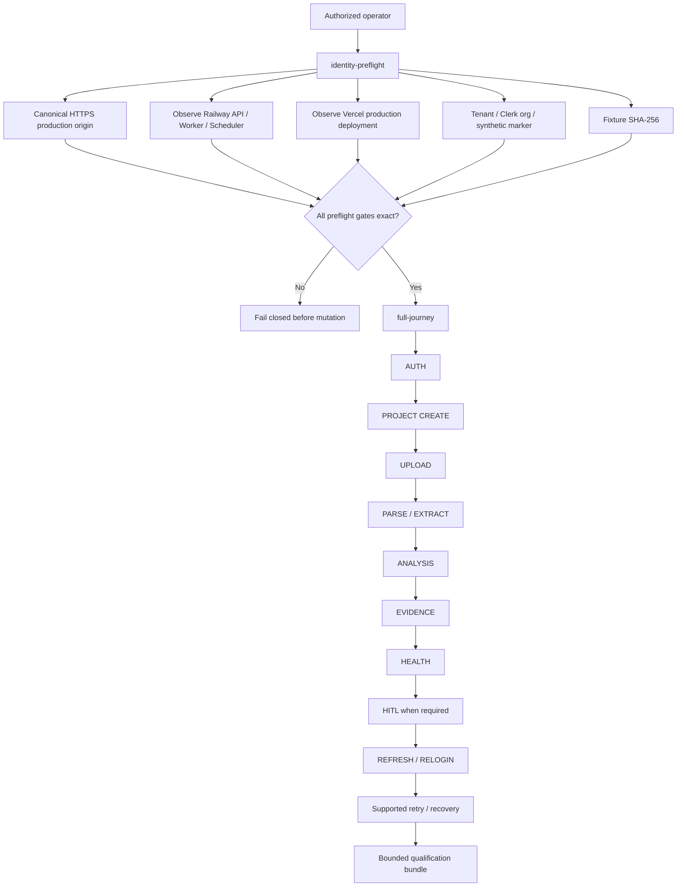

# C2Pro — Current Architecture Flows

**Version:** 2.0.0  
**Last reconciled:** 2026-10-01  
**Status:** Current supporting diagrams  
**Canonical design:** [TDD v4.2](./C2PRO_TECHNICAL_DESIGN_DOCUMENT_v4_2.md) + [ADR index](./decisions/README.md)

These diagrams are explanatory projections of the current architecture. Accepted ADRs, executable code/schema and machine control remain authoritative.

---

## 1. Authority planes

```mermaid
flowchart TD
    A[Runtime / Schema Truth<br/>code + migrations + runtime evidence]
    B[Merge Enforcement<br/>GitHub ruleset + workflows]
    C[Product Lifecycle<br/>validation/product YAML + validators]
    D[Development Control<br/>.c2pro/control + .c2pro/work]
    E[Architecture<br/>Accepted ADRs + TDD v4.2]
    F[Operations<br/>Runbooks]
    G[Historical Proof<br/>Git / PR / CI / evidence bundles]

    E --> A
    D --> G
    C --> G
    B --> G
    F --> A
```

No single Markdown file owns all seven concerns.

---

## 2. Project-intelligence flow

```mermaid
flowchart LR
    U[User / Project Inputs] --> E[Evidence-bearing Documents]
    E --> PS[Project State]
    PS --> WBS[Canonical Hierarchical WBS<br/>Project Controls Backbone]

    WBS --> SCH[Schedule]
    WBS --> BUD[Budget]
    WBS --> PROC[Procurement]
    WBS --> STK[Stakeholders / RACI]
    WBS --> EV[Evidence Links]

    PS --> PG[ProjectGraph]
    PG --> H[Project Health]
    PG --> C[Coherence]
    PG --> CH[Change / Temporal Intelligence]
    PG --> AL[Alerts]

    H --> UI[Read Models / UI]
    C --> UI
    CH --> UI
    AL --> UI
```

**Invariants**

- Project is the intelligence boundary.
- One project owns one canonical WBS.
- Domain planes attach to that WBS or explicitly project-level scope.
- Evidence locators remain truthful; unknown is not zero.

---

## 3. Document processing and project synthesis

```mermaid
flowchart TD
    UP[Upload] --> ING[Ingestion / Parsing]
    ING --> EXT[Extraction / Candidate Artifacts]
    EXT --> DUR[Durable Candidate Evidence]

    DUR --> DOCFLOW[Document-level Processing]
    DOCFLOW --> PGQ[ProjectGraph Queue / Trigger]
    PGQ --> PGS[Project-level Synthesis]

    PGS --> COH[Coherence]
    PGS --> HEALTH[Health]
    PGS --> CHANGE[Temporal / Change]
    PGS --> ALERTS[Alerts]

    DUR --> HITL{HITL required?}
    HITL -- No --> TRUST[Trusted-State Commit]
    HITL -- Yes --> REVIEW[Human Review]
    REVIEW -- Approve exact candidate --> TRUST
    REVIEW -- Reject --> HOLD[Canonical state unchanged]
    REVIEW -- Correct --> NEWC[New candidate/version]
    NEWC --> REVIEW

    TRUST --> CANON[Canonical trusted state]
    CANON --> PGQ
```

Document persistence and trusted promotion are separate operations.

---

## 4. Trusted-State Commit

```mermaid
sequenceDiagram
    participant AI as AI / Candidate Producer
    participant DB as Durable Candidate Store
    participant H as Human Reviewer
    participant TC as Trusted Commit Boundary
    participant P as Canonical Projections

    AI->>DB: persist candidate + identity/version/hash
    DB-->>H: exact review payload
    H->>TC: approval bound to exact candidate
    TC->>TC: verify identity/version/hash + currentness

    alt exact and valid
        TC->>DB: promote trusted state idempotently
        TC->>P: recompute/promote canonical ProjectGraph/Health/Coherence
    else stale/substituted/rejected
        TC-->>H: fail closed / no canonical mutation
    end
```

See ADR-026.

---

## 5. Trusted vs projected Coherence

```mermaid
flowchart LR
    TE[Trusted Evidence] --> S[Canonical Scorer / Version]
    S --> TS[trusted_score<br/>canonical]

    TE --> P[Explicit Pending Scenario]
    PC[Pending Candidate] --> P
    P --> S2[Same Canonical Scorer / Compatible Version]
    S2 --> PS[projected_score<br/>hypothetical]

    TS --> OFF[Official State / Export]
    PS --> ADV[Advisory UI only<br/>clearly labelled]
```

Projected state never silently replaces trusted state.

---

## 6. Authentication and tenant boundary

```mermaid
flowchart TD
    R[Request] --> ID[Clerk / supported identity verification]
    ID --> MAP[Resolve authorized internal user + tenant/org context]
    MAP --> APP[Application authorization]
    APP --> DB[Tenant-scoped repository/session]
    DB --> RLS[PostgreSQL RLS / privilege boundary]
    RLS --> DATA[Authorized tenant data]

    ID -. invalid .-> DENY[Fail closed]
    MAP -. mismatch .-> DENY
    APP -. unauthorized .-> DENY
    DB -. invalid tenant context .-> DENY
```

Platform-operator paths may use a distinct explicit operator boundary; they must not accidentally bootstrap or inherit customer-tenant authority.

---

## 7. Development-control flow

```mermaid
flowchart TD
    PLAN[Planner / Master] --> CTRL[.c2pro/control]
    CTRL --> ENV[.c2pro/work/<work_id>.yaml]
    ENV --> W[Implementation Worker]
    W --> RES[c2pro-implementation-result-v1]
    RES --> REV[Independent Review / Challenger<br/>per risk policy]
    REV --> CI[Required CI / Checks]
    CI --> PR[PR / Merge]
    PR --> REC[Planner / Master Reconciliation]
    REC --> CTRL

    LEG[Legacy backlog / blackboard] -. read-only reconciliation only .-> PLAN
```

Ordinary workers never mutate legacy backlog/blackboard state.

---

## 8. CI / merge / release / qualification

```mermaid
flowchart TD
    PR[Pull Request] --> CI[Consolidated ci.yml]
    PR --> SEC[gitleaks]
    PR --> IDG[Install Drift Guard]
    CI --> CIS[CI Status]
    CIS --> RULE[Main Ruleset]
    SEC --> RULE
    IDG --> RULE

    RULE --> MERGE[Merge to protected main]
    MERGE --> DEPLOY[Provider-owned platform deploy]
    MERGE --> TAG[Release Tag]

    TAG --> REL[release.yml certify]
    REL --> PUB[Protected Production env<br/>GitHub Release publish]

    MERGE --> QUAL[Protected product qualification<br/>when required]
    QUAL --> EVID[Qualification Evidence]
    EVID --> PC[Human Product Control Reconciliation]
```

Merge, platform deploy, release publication and product production-qualification are distinct claims.

---

## 9. #715 production qualification

```mermaid
flowchart TD
    OP[Authorized operator] --> PRE[identity-preflight]
    PRE --> ORIGIN[Canonical HTTPS production origin]
    PRE --> RAIL[Observe Railway API / Worker / Scheduler]
    PRE --> VER[Observe Vercel production deployment]
    PRE --> TEN[Tenant / Clerk org / synthetic marker]
    PRE --> FIX[Fixture SHA-256]

    ORIGIN --> G{All preflight gates exact?}
    RAIL --> G
    VER --> G
    TEN --> G
    FIX --> G

    G -- No --> STOP[Fail closed before mutation]
    G -- Yes --> FULL[full-journey]

    FULL --> AUTH[AUTH]
    AUTH --> CREATE[PROJECT CREATE]
    CREATE --> UP[UPLOAD]
    UP --> PARSE[PARSE / EXTRACT]
    PARSE --> ANA[ANALYSIS]
    ANA --> EV[EVIDENCE]
    EV --> HEALTH[HEALTH]
    HEALTH --> HITL[HITL when required]
    HITL --> RELOGIN[REFRESH / RELOGIN]
    RELOGIN --> RECOV[Supported retry / recovery]
    RECOV --> BUNDLE[Bounded qualification bundle]
```

Harness implementation being merged is not proof that this full journey passed.

---

## 10. Historical diagrams

Earlier February/March diagrams remain useful as point-in-time evidence but are no longer the current architecture baseline. Do not use older provider trees, fixed route inventories, blackboard/backlog orchestration diagrams or pre-ADR-025 WBS relationships to override the current TDD/ADRs.
