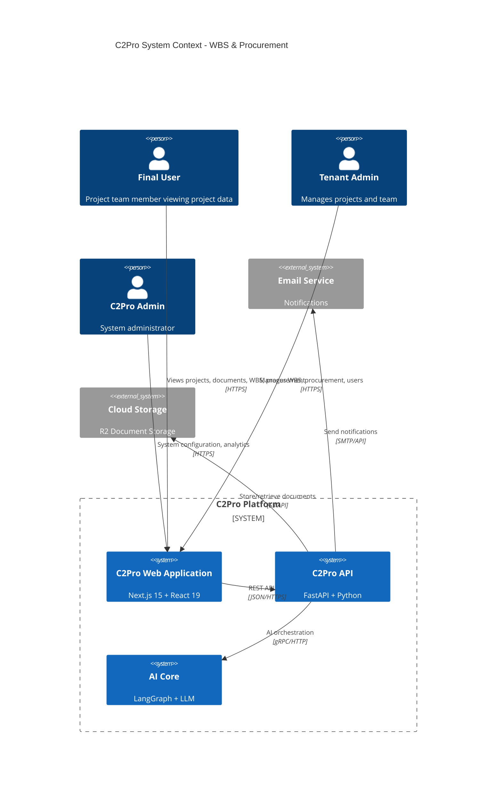
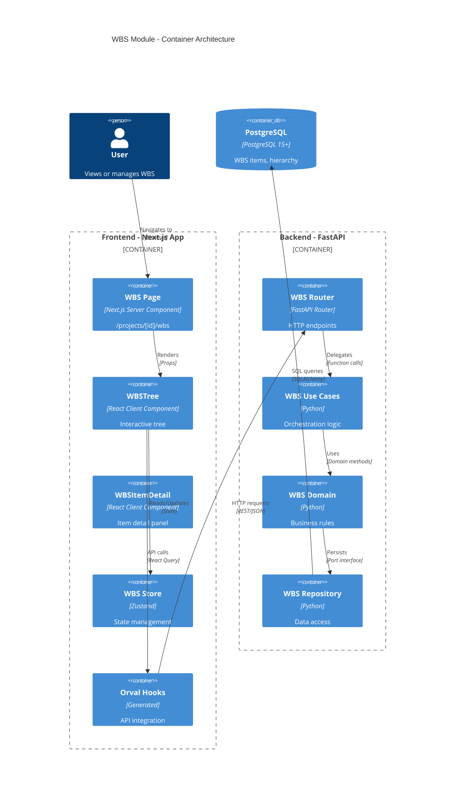
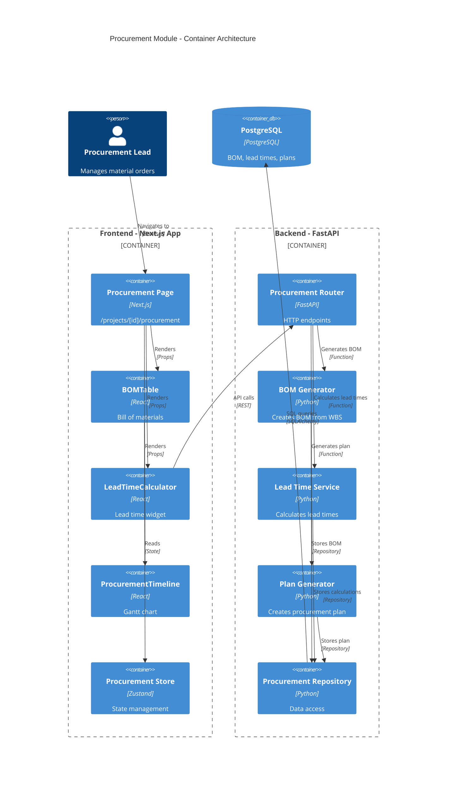
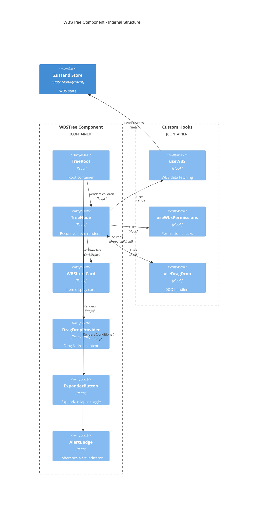
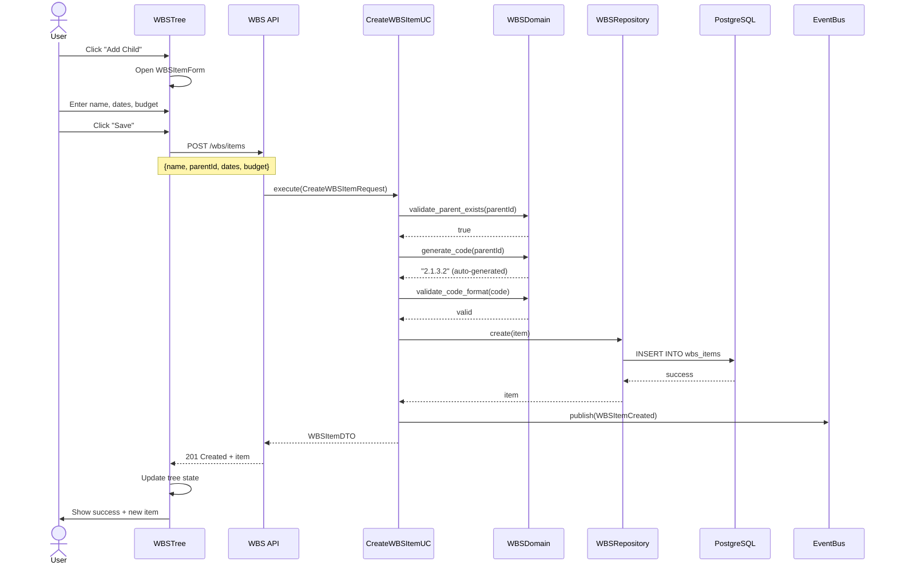
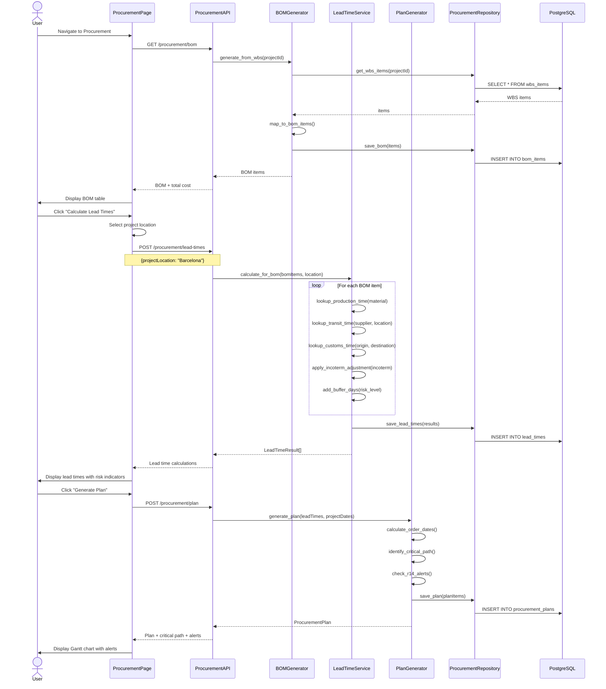
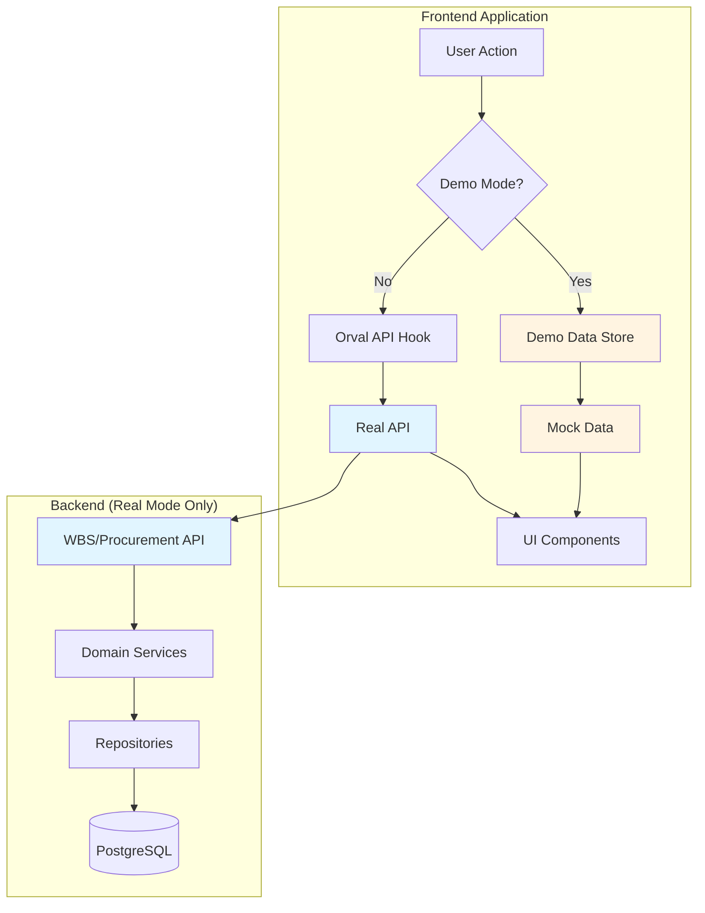
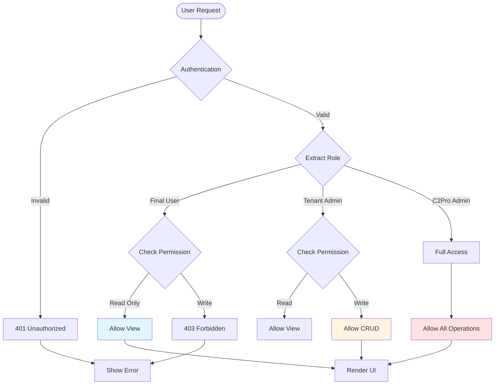
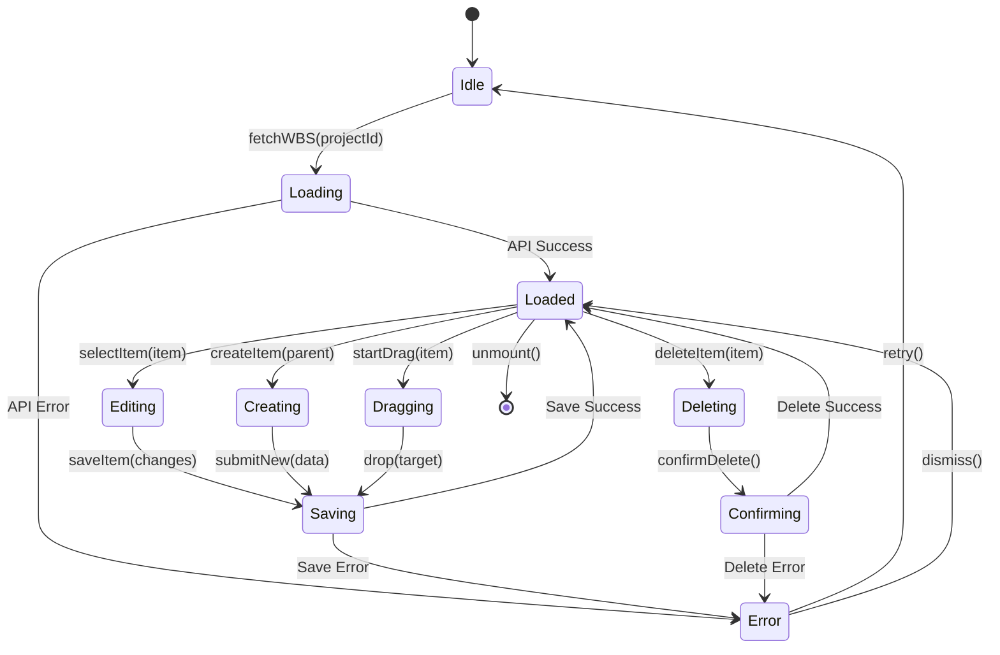

# C2Pro UX Implementation - Architecture Diagrams

## Overview

This document provides visual architecture diagrams for the WBS Management and Procurement Intelligence modules.

---

## 1. System Context



---

## 2. Container Diagram - WBS Module



---

## 3. Container Diagram - Procurement Module



---

## 4. Component Diagram - WBS Tree



---

## 5. Component Diagram - Procurement Dashboard

```mermaid
C4Component
    title Procurement Dashboard - Internal Structure

    Container_Boundary(dashboard, "Procurement Dashboard") {
        Component(tabs, "TabNavigation", "React", "BOM | Lead Times | Plan | Alerts")

        Container_Boundary(bomTab, "BOM Tab") {
            Component(bomTable, "BOMTable", "React", "Sortable table")
            Component(costSummary, "CostSummary", "React", "Total cost display")
            Component(wbsFilter, "WBSFilter", "React", "Filter by WBS item")
        }

        Container_Boundary(ltTab, "Lead Times Tab") {
            Component(ltWidget, "LeadTimeWidget", "React", "Calculator form")
            Component(ltResults, "LeadTimeResults", "React", "Results display")
            Component(incotermSel, "IncotermSelector", "React", "Dropdown")
            Component(riskIndicator, "RiskIndicator", "React", "Risk badges")
        }

        Container_Boundary(planTab, "Plan Tab") {
            Component(gantt, "ProcurementGantt", "React", "Timeline chart")
            Component(criticalPath, "CriticalPathOverlay", "React", "Highlight")
            Component(orderMarkers, "OrderDateMarkers", "React", "Milestones")
        }

        Container_Boundary(alertsTab, "Alerts Tab") {
            Component(alertList, "ProcurementAlertList", "React", "Alert cards")
            Component(alertActions, "AlertActionButtons", "React", "Resolve/Dismiss")
        }
    }

    Rel(tabs, bomTab, "Switches to", "Click")
    Rel(tabs, ltTab, "Switches to", "Click")
    Rel(tabs, planTab, "Switches to", "Click")
    Rel(tabs, alertsTab, "Switches to", "Click")
```

---

## 6. Sequence Diagram - Create WBS Item



---

## 7. Sequence Diagram - Generate Procurement Plan



---

## 8. Data Flow - Demo Mode



---

## 9. Role-Based Access Flow



---

## 10. State Management - WBS Store



---

## 11. Deployment Architecture

```mermaid
C4Deployment
    title Production Deployment - Kubernetes

    Deployment_Node(cdn, "Cloudflare CDN", "Edge Network") {
        Container(static, "Static Assets", "Next.js Build")
    }

    Deployment_Node(k8s, "Kubernetes Cluster", "AWS EKS / GCP GKE") {
        Deployment_Node(frontend, "Frontend Namespace") {
            Container(nextjs, "Next.js App", "3 replicas", "Port 3000")
        }

        Deployment_Node(backend, "Backend Namespace") {
            Container(api, "FastAPI App", "3 replicas", "Port 8000")
            Container(celery, "Celery Workers", "2 replicas", "Async tasks")
        }

        Deployment_Node(data, "Data Namespace") {
            Container(postgres, "PostgreSQL", "Primary + Replica")
            Container(redis, "Redis", "Cache + Event Bus")
        }
    }

    Deployment_Node(storage, "Object Storage", "Cloudflare R2") {
        Container(docs, "Documents", "PDF, DOCX, XLSX")
    }

    Rel(cdn, nextjs, "Cache miss", "HTTPS")
    Rel(nextjs, api, "API calls", "Internal HTTPS")
    Rel(api, postgres, "SQL", "Port 5432")
    Rel(api, redis, "Cache/Events", "Port 6379")
    Rel(api, storage, "Files", "S3 API")
    Rel(celery, redis, "Queue", "Port 6379")
```

---

## Legend

### C4 Model Notation

- **Person**: End users and roles
- **System**: High-level systems
- **Container**: Applications or data stores within a system
- **Component**: Building blocks within a container
- **Relationship**: Connections between elements

### Color Coding

- 🟦 Blue: Frontend/React components
- 🟩 Green: Backend/Python components
- 🟨 Yellow: Data stores
- 🟥 Red: External systems
- 🟪 Purple: Infrastructure

---

_Diagrams created with Mermaid.js_  
_Part of UX Implementation Master Plan v1.0_
