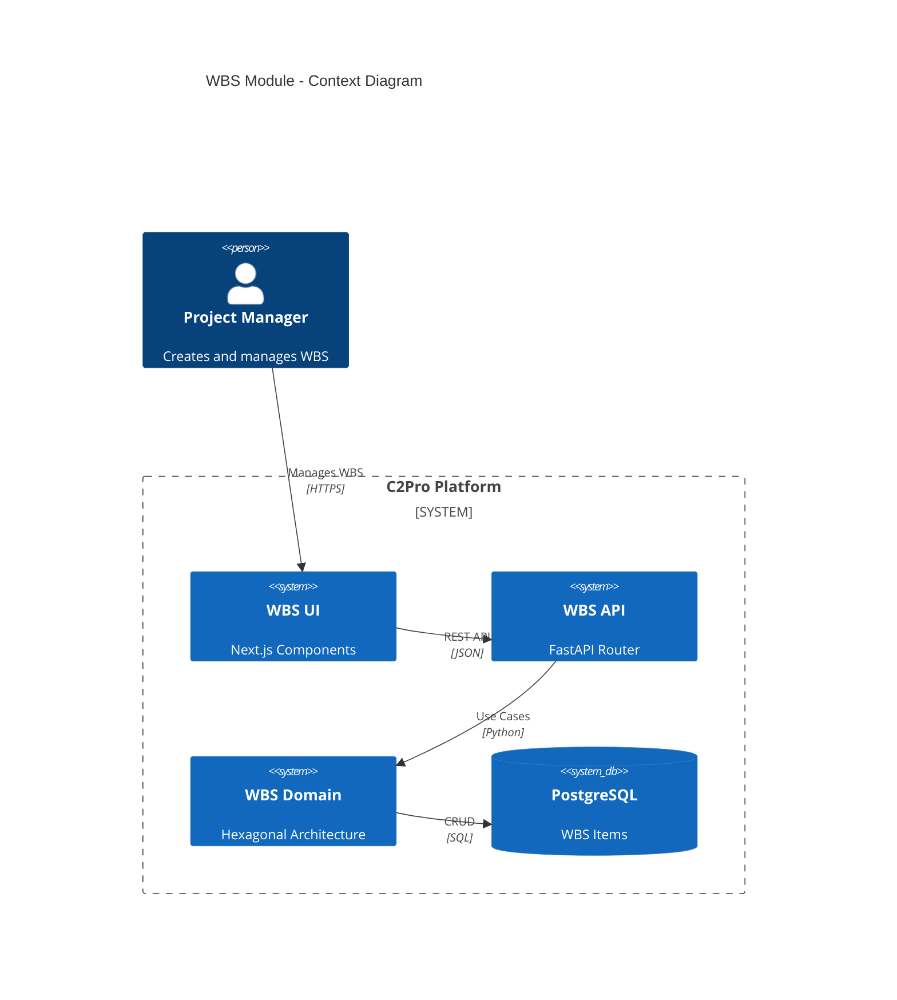
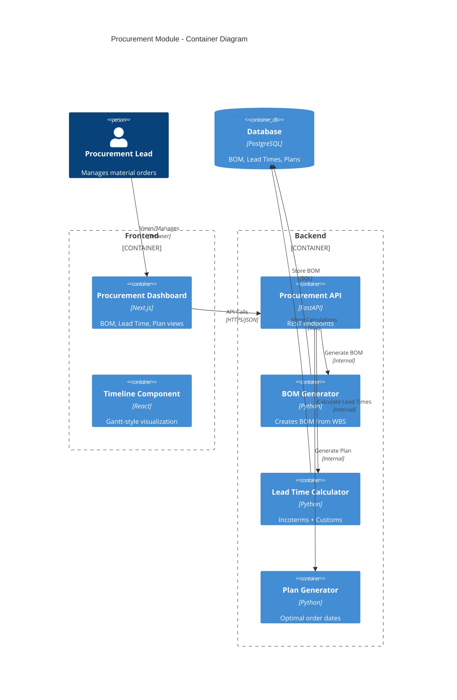
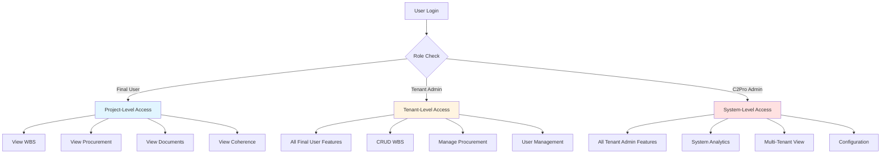

# C2Pro UX Implementation Master Plan

**Planner:** @planner-agent  
**Based on:** UX_AUDIT_REPORT_v1.0.md  
**Date:** 2026-02-15  
**Status:** Ready for Execution

---

## Executive Summary

This plan addresses the critical gap identified in the UX Audit: **Backend features (WBS, Procurement) are 100% complete but have 0% frontend exposure**.

We will implement **two parallel visualization tracks**:

1. **Real Status Implementation** - Production-ready features by role
2. **Demo/Mock Showcase** - Full-featured visualization for sales/demos

### Key Product Principles

- **User-First Design:** Every feature maps to a specific user journey and outcome
- **Cross-Module Integration:** WBS, Procurement, and Coherence are interconnected, not silos
- **Progressive Disclosure:** Simple for beginners, powerful for experts
- **Mobile-First Field Use:** Critical workflows work on tablets and phones at construction sites
- **Demo That Converts:** Interactive scenarios that show real value, not just static screens

---

## 1. Dual Visualization Strategy

### Track A: Real Status (Production)

**Purpose:** Deliver actual working features to users based on their role permissions

| Role             | Access Level  | Features Visible                                                                 |
| ---------------- | ------------- | -------------------------------------------------------------------------------- |
| **Final User**   | Project-level | Documents, Coherence, Alerts, Evidence, WBS View (Read), Procurement View (Read) |
| **Tenant Admin** | Tenant-level  | All Final User features + WBS CRUD, Procurement Planning, User Management        |
| **C2Pro Admin**  | System-level  | All features + System Analytics, Multi-tenant oversight, Configuration           |

### Track B: Demo/Mock Mode (Sales/Onboarding)

**Purpose:** Showcase full platform capabilities with realistic mock data

- **Visual:** Complete UI with all features enabled
- **Data:** Rich, realistic mock datasets (Torre Skyline project)
- **Interaction:** Full click-through experience
- **No Backend:** Static JSON responses, no API calls
- **Use Cases:** Sales demos, user onboarding, feature previews

---

## 2. Missing Features - Detailed Breakdown

### 2.1 WBS Management Module

**Current State:** Backend 100% | Frontend 0%

#### Required Components

```typescript
// WBS Tree View
interface WBSViewProps {
  projectId: string;
  hierarchy: WBSHierarchy;
  onItemSelect: (item: WBSItem) => void;
  readOnly?: boolean;
}

// WBS Item Detail
interface WBSItemDetailProps {
  item: WBSItem;
  linkedClauses: Clause[];
  budgetAllocation: Money;
  alerts: Alert[];
  onEdit?: (item: WBSItem) => void;
}

// WBS Code Editor
interface WBSCCodeEditorProps {
  level: 1 | 2 | 3 | 4;
  parentCode?: string;
  existingCodes: string[];
  onValidate: (code: string) => ValidationResult;
}
```

#### User Stories by Role

**Final User (Read-Only)**

- View WBS tree structure (1, 1.1, 1.1.1, 1.1.1.1)
- See WBS item details (name, dates, budget, completion)
- View linked clauses per WBS item
- See alerts related to WBS (R11, R12, R13)
- Export WBS to PDF/Excel

**Tenant Admin (Full CRUD)**

- Create new WBS items with auto-generated codes
- Edit WBS item properties
- Move items within hierarchy (drag & drop)
- Delete WBS items (with cascade confirmation)
- Link/unlink clauses to WBS items
- Assign budget to WBS items
- Validate WBS coverage against contract scope

**C2Pro Admin (System)**

- View WBS across all tenants
- WBS template management
- Bulk operations
- Analytics: Average WBS depth, coverage metrics

---

### 2.2 Procurement Intelligence Module

**Current State:** Backend 100% | Frontend 0%

#### Required Components

```typescript
// Procurement Dashboard
interface ProcurementDashboardProps {
  projectId: string;
  bom: BOMItem[];
  leadTimes: LeadTimeCalculation[];
  procurementPlan: ProcurementPlanItem[];
  alerts: ProcurementAlert[];
}

// BOM Table
interface BOMTableProps {
  items: BOMItem[];
  wbsMapping: Record<string, WBSItem>;
  onItemClick: (item: BOMItem) => void;
  showCosts: boolean;
}

// Lead Time Calculator
interface LeadTimeCalculatorProps {
  material: Material;
  supplierLocation: Location;
  projectLocation: Location;
  incoterm: Incoterm;
  onCalculate: (result: LeadTimeResult) => void;
}

// Procurement Timeline
interface ProcurementTimelineProps {
  plan: ProcurementPlanItem[];
  projectStartDate: Date;
  projectEndDate: Date;
  criticalPath: string[];
}
```

#### User Stories by Role

**Final User (View)**

- View BOM generated from WBS
- See material lead times with incoterms
- View procurement plan with order dates
- See alerts for late orders (R14)
- View customs clearance estimates
- Export procurement plan

**Tenant Admin (Manage)**

- Regenerate BOM from WBS
- Adjust lead time parameters
- Set incoterms per material
- Override procurement dates
- Mark items as ordered/received
- Manage supplier information

**C2Pro Admin (Configure)**

- Configure default incoterms by region
- Set lead time calculation rules
- Manage customs time database
- Procurement analytics dashboard

---

### 2.3 Enhanced Project Overview

**Current State:** Static mock data | Needs: Real-time integration

#### Required Components

```typescript
// Real-time Project Stats
interface ProjectStatsProps {
  projectId: string;
  coherenceScore: number;
  wbsCompletion: number;
  budgetUtilization: number;
  procurementStatus: ProcurementStatus;
  activeAlerts: AlertSummary;
}

// Project Navigation
interface ProjectTabsProps {
  projectId: string;
  activeTab:
    | "overview"
    | "wbs"
    | "procurement"
    | "documents"
    | "analysis"
    | "coherence"
    | "evidence";
  userRole: UserRole;
}
```

---

## 3. User Journey Maps

### Journey 1: First-Time Project Setup (Goal: 30 minutes)

**User:** Tenant Admin setting up a new construction project  
**Outcome:** Complete WBS structure with procurement plan ready for execution

```
Step 1: Upload Contract Document (2 min)
├─ Action: Drag & drop PDF contract
├─ System: Extract clauses automatically
└─ Success: 47 clauses identified

Step 2: Review Extracted Clauses (5 min)
├─ Action: Browse clauses by category
├─ Action: Validate key dates and amounts
└─ Success: Clause extraction confirmed 92% accurate

Step 3: Generate WBS from Clauses (1 min)
├─ Action: Click "Generate WBS Structure"
├─ System: AI suggests WBS based on contract scope
├─ Output: 47 WBS items across 4 levels
└─ Success: WBS generated with 85% coverage

Step 4: Refine WBS Structure (10 min)
├─ Action: Review auto-generated codes (1.1, 1.1.1, etc.)
├─ Action: Edit item names for clarity
├─ Action: Adjust parent-child relationships
├─ Action: Add missing work packages
├─ System: Real-time validation (no duplicate codes)
└─ Success: WBS coverage reaches 100%

Step 5: Assign Budgets and Dates (5 min)
├─ Action: Enter budget per WBS item
├─ Action: Set start/end dates
├─ System: Validate budget sum matches contract
├─ System: Check date consistency
└─ Success: Budget fully allocated, dates logical

Step 6: Generate BOM from WBS (1 min)
├─ Action: Click "Generate Bill of Materials"
├─ System: Map WBS items to material requirements
├─ Output: 23 BOM line items
└─ Success: BOM covers all WBS work packages

Step 7: Configure Procurement Parameters (3 min)
├─ Action: Enter project location
├─ Action: Assign suppliers to materials
├─ Action: Select incoterms (CIF, DDP, etc.)
├─ Action: Set buffer days for critical items
└─ Success: All materials have supplier + delivery params

Step 8: Calculate Lead Times (1 min)
├─ Action: Click "Calculate Lead Times"
├─ System: Compute production + transit + customs + buffer
├─ Output: Lead times for all 23 items
├─ System: Identify R14 alerts (late orders)
└─ Success: 3 critical lead time alerts generated

Step 9: Review Procurement Plan (1 min)
├─ Action: View Gantt chart timeline
├─ Action: Identify critical path
├─ Action: Review order-by dates
└─ Success: Procurement plan optimized

Step 10: Export and Share (1 min)
├─ Action: Export WBS to Excel
├─ Action: Export procurement plan to PDF
├─ Action: Share with procurement team
└─ Success: Team has complete project plan

TOTAL TIME: 30 minutes
SUCCESS METRICS:
- 100% WBS coverage
- 0 coherence rule violations
- Procurement plan with 3 actionable alerts
```

### Journey 2: Weekly Project Review (Goal: 15 minutes)

**User:** Project Manager reviewing weekly progress  
**Outcome:** Updated project status, resolved blockers, adjusted plan

```
Step 1: Open Project Dashboard (30 sec)
├─ View: Coherence score trend
├─ View: Open alerts count
├─ View: Budget utilization
└─ Decision: Review needed if score < 80

Step 2: Review Coherence Score (2 min)
├─ View: 6 category breakdown
├─ Drill-down: Click "Budget" (lowest score)
├─ View: 5 alerts affecting budget
└─ Action: Note top 3 priorities

Step 3: Check WBS Completion (3 min)
├─ View: WBS tree with completion percentages
├─ Filter: Show only incomplete items (>0% and <100%)
├─ Identify: Foundation work at 60%
└─ Action: Add note to follow up with contractor

Step 4: Review Procurement Status (3 min)
├─ View: Procurement Gantt chart
├─ Identify: Steel rebar delivery in 2 days
├─ Check: Confirm delivery address with supplier
└─ Action: Mark as "Confirmed" in system

Step 5: Resolve Alerts (5 min)
├─ View: Alert center with 7 open alerts
├─ Review: R14 - Steel rebar deadline approaching
├─ Action: Contact supplier to confirm on-time delivery
├─ Mark: Alert as "Monitoring"
└─ Success: 6 remaining alerts prioritized

Step 6: Update Stakeholders (1 min)
├─ View: Stakeholder power/interest matrix
├─ Identify: Client needs update (high power, high interest)
├─ Action: Generate weekly report
├─ Send: Email to client with coherence score and progress
└─ Success: Stakeholders informed

TOTAL TIME: 15 minutes
SUCCESS METRICS:
- All critical alerts acknowledged
- Procurement deliveries confirmed
- Stakeholders updated
```

### Journey 3: Alert Resolution with HITL (Goal: 10 minutes)

**User:** Tenant Admin resolving coherence alert  
**Outcome:** Alert resolved, coherence score recalculated, lessons learned

```
Step 1: Receive Alert Notification (Real-time)
├─ Channel: Email + In-app notification
├─ Alert: R12 - WBS items without budget allocation
├─ Severity: High
└─ Action: Click notification to open alert

Step 2: Review Alert Details (2 min)
├─ View: Alert description and rule (R12)
├─ View: 5 affected WBS items listed
├─ View: Linked clauses showing contract requirements
└─ Understanding: Budget not assigned to "Site Cleanup" items

Step 3: Navigate to Affected Items (1 min)
├─ Click: WBS item "2.3.1 Site Cleanup Phase 1"
├─ View: Item details show $0 budget
├─ View: Contract clause requires €15,000 allocation
└─ Decision: Allocate budget per contract

Step 4: Resolve the Issue (3 min)
├─ Action: Click "Edit" on WBS item
├─ Action: Enter budget: €15,000
├─ Action: Add note: "Per clause 4.2, allocated per contract"
├─ Action: Save changes
└─ System: Validation passed

Step 5: Bulk Apply to Similar Items (2 min)
├─ Action: Select remaining 4 cleanup items
├─ Action: Click "Bulk Edit"
├─ Action: Allocate proportional budgets
├─ Action: Save all
└─ Success: All 5 items now have budget

Step 6: Resolve Alert (1 min)
├─ Action: Return to alert detail
├─ Action: Click "Mark Resolved"
├─ System: Trigger coherence recalculation
├─ Result: Score improves from 78 to 84
└─ Success: Alert closed

Step 7: Document Learning (1 min)
├─ Optional: Add resolution note
├─ "Budget allocation template now includes cleanup phase"
└─ Success: Knowledge captured for future projects

TOTAL TIME: 10 minutes
SUCCESS METRICS:
- Alert resolved
- Coherence score improved (+6 points)
- Root cause documented
```

---

## 4. Enhanced User Stories

### 4.1 WBS Management - Final User Stories

**Navigation & Discovery:**

- "As a Project Manager, I want to **filter WBS by completion status** (0%, 1-99%, 100%) so I can focus on work in progress"
- "As a Project Manager, I want to **search WBS items by name, code, or description** so I can quickly find specific work packages without scrolling"
- "As a Project Manager, I want to **see WBS items color-coded by alert severity** (green=ok, yellow=warning, red=critical) so I can prioritize issues at a glance"
- "As a Project Manager, I want to **expand/collapse all tree levels with one click** so I can navigate large projects efficiently (50+ items)"
- "As a Project Manager, I want to **bookmark frequently accessed WBS items** so I can jump to critical path items quickly"

**Context & Understanding:**

- "As a Project Manager, I want to **see the linked contract clause when viewing a WBS item** so I understand the contractual basis for the work"
- "As a Project Manager, I want to **see which documents reference this WBS item** so I can access relevant specs and drawings"
- "As a Project Manager, I want to **view WBS item history** (creation, edits, status changes) so I can track who changed what and when"
- "As a Project Manager, I want to **see dependent WBS items** (what must finish before this starts) so I understand the critical path"

**Reporting & Export:**

- "As a Project Manager, I want to **export WBS as a formatted PDF** suitable for client presentations so I can share progress professionally"
- "As a Project Manager, I want to **export WBS to MS Project format** so I can continue detailed scheduling in specialized tools"

### 4.2 WBS Management - Tenant Admin Stories

**Efficiency & Productivity:**

- "As a Tenant Admin, I want to **bulk import WBS from Excel/CSV** so I don't have to create 100+ items manually for large projects"
- "As a Tenant Admin, I want to **copy WBS structure from a template project** so I can standardize WBS across similar projects (e.g., all residential towers)"
- "As a Tenant Admin, I want to **undo the last 3 actions** so I can recover from accidental deletes or wrong moves"
- "As a Tenant Admin, I want to **see a preview of code changes** before saving so I avoid breaking the 4-level hierarchy"
- "As a Tenant Admin, I want to **drag-select multiple WBS items** so I can bulk edit budgets or dates efficiently"

**Quality & Validation:**

- "As a Tenant Admin, I want to **run WBS validation on-demand** so I can check for rule violations (R11, R12, R13) before generating BOM"
- "As a Tenant Admin, I want to **see suggested parent items when creating new WBS** so I maintain logical hierarchy"
- "As a Tenant Admin, I want to **auto-generate WBS codes with custom prefixes** so our codes match company standards (e.g., PRJ-001-1.1.1)"
- "As a Tenant Admin, I want to **lock WBS items once procurement has started** so I don't accidentally change items with active orders"

### 4.3 Procurement - Final User Stories

**Visibility & Tracking:**

- "As a Procurement Lead, I want to **attach a PDF purchase order** to a procurement item so all documentation is centralized"
- "As a Procurement Lead, I want to **see a running total of all open orders** against the project budget so I know committed spend vs remaining"
- "As a Procurement Lead, I want to **filter BOM by delivery status** (planned, ordered, in transit, delivered) so I can track what's happening"
- "As a Procurement Lead, I want to **see which WBS item each material supports** so I understand the construction context"
- "As a Procurement Lead, I want to **compare estimated vs actual costs** as orders are placed so I can identify budget variances early"

**Decision Support:**

- "As a Procurement Lead, I want to **reassign a delayed order to a different supplier** and immediately see the impact on lead time and critical path"
- "As a Procurement Lead, I want to **run what-if scenarios** (e.g., "What if I switch from CIF to DDP?") so I can optimize costs and timelines"
- "As a Procurement Lead, I want to **see supplier performance history** (on-time delivery, quality issues) so I can make informed vendor selections"
- "As a Procurement Lead, I want to **get automatic alerts when order deadlines approach** (R14) with suggested actions so I never miss critical orders"

**Collaboration:**

- "As a Procurement Lead, I want to **add comments/notes on procurement items** so my team knows about special requirements or issues"
- "As a Procurement Lead, I want to **assign procurement items to team members** so responsibilities are clear"
- "As a Procurement Lead, I want to **@mention team members in comments** for urgent items so they get notified"
- "As a Procurement Lead, I want to **share the procurement plan view-only link** with suppliers so they can see their delivery commitments"

### 4.4 Procurement - Tenant Admin Stories

**Advanced Management:**

- "As a Tenant Admin, I want to **configure default incoterms by supplier location** so lead time calculations use the right terms automatically"
- "As a Tenant Admin, I want to **maintain a supplier database** with contact info, locations, and performance ratings so procurement planning is efficient"
- "As a Tenant Admin, I want to **set up procurement approval workflows** (e.g., orders >€50k require manager approval) so we maintain spend controls"
- "As a Tenant Admin, I want to **bulk update incoterms** for all items from a specific supplier so I can respond to vendor changes quickly"

**Integration & Automation:**

- "As a Tenant Admin, I want to **auto-generate purchase orders in PDF** from the procurement plan so I can send them to suppliers immediately"
- "As a Tenant Admin, I want to **import actual delivery dates from supplier APIs** (if available) so the system stays current without manual updates"
- "As a Tenant Admin, I want to **export procurement data to our ERP system** so finance has real-time committed spend visibility"

---

## 5. Cross-Module Navigation

### 5.1 Navigation Patterns

**WBS ↔ Procurement Integration:**

```
WBS Item Detail View
├─ Linked Procurement Items Section
│  ├─ List: Materials required for this WBS item
│  ├─ Status: Ordered / In Transit / Delivered
│  ├─ Budget: Allocated vs Actual spend
│  └─ Action: "View in Procurement Plan" button
│
└─ Click → Opens Procurement Plan filtered to this WBS item

Procurement Item Detail View
├─ Parent WBS Item Section
│  ├─ Name & Code: "2.1.3.1 Reinforcement"
│  ├─ Completion: 45% complete
│  ├─ Start Date: 2025-05-15 (material needed by)
│  └─ Action: "View WBS Item" button
│
└─ Click → Opens WBS Tree focused on parent item
```

**Alert ↔ Entity Navigation:**

```
Alert Detail View (R14 - Late Order)
├─ Affected Entities Section
│  ├─ Procurement Item: Steel Rebar (bom-001)
│  ├─ WBS Item: 2.1.3.1 Reinforcement
│  ├─ Linked Clauses: Clause 4.2, Clause 7.1
│  └─ Documents: Contract_Section_4.pdf
│
├─ Actions:
│  ├─ "View Procurement Item" → /procurement/bom/bom-001
│  ├─ "View WBS Item" → /wbs/wbs-002-1-3-1
│  ├─ "View Clause" → opens evidence viewer
│  └─ "Download Contract" → downloads PDF
│
└─ Resolution Flow:
   ├─ "Mark Resolved" requires:
   │  ├─ Contacted supplier (checkbox)
   │  ├─ Confirmed delivery date (date picker)
   │  └─ Added resolution note (text area)
   └─ On resolve → Triggers coherence recalculation
```

**Coherence Score ↔ Deep Dive:**

```
Coherence Dashboard
├─ Category Card: "Budget Score: 62" (lowest)
├─ Click → Opens Budget Detail View
│  ├─ Affected WBS Items: List of items with budget issues
│  ├─ Affected Procurement: Over-budget line items
│  ├─ Rule Violations: R12, R16 alerts
│  └─ Suggested Actions: "Allocate €45k to WBS items"
│
└─ Action Buttons:
   ├─ "View WBS Items" → /wbs?filter=budget_issues
   ├─ "View Procurement" → /procurement?filter=over_budget
   └─ "Review Alerts" → /alerts?category=budget
```

### 5.2 Context Preservation

**Breadcrumb Navigation:**

```
Projects > Torre Skyline > WBS > 2.1.3.1 Reinforcement > Procurement
                                    ↑
                                    Click to go back to WBS item

Projects > Torre Skyline > Procurement > Steel Rebar > WBS Parent
                                                 ↑
                                                 Click to see parent WBS
```

**Cross-Module Search:**

```
Global Search: "foundation"
Results:
├─ WBS Items (3)
│  ├─ 2.1 Foundation
│  ├─ 2.1.1 Excavation
│  └─ 2.1.2 Piling Works
├─ Procurement Items (2)
│  ├─ Ready-Mix Concrete (for foundation slab)
│  └─ Steel Rebar (for foundation reinforcement)
├─ Documents (5)
│  ├─ Foundation_Specs.pdf
│  └─ Geotechnical_Report.pdf
└─ Alerts (1)
   └─ R14: Foundation material delivery delay
```

---

## 6. Mobile-First Use Cases

### 6.1 Field Engineer Mobile Flow

**Persona:** Field Engineer walking the construction site with a tablet  
**Device:** iPad or rugged Android tablet  
**Context:** Outdoors, wearing gloves, need quick access

**Use Case 1: Mark WBS Item Complete**

```
Scenario: Engineer finishes "2.1.1 Excavation" work

Step 1: Scan QR Code
├─ Physical QR code posted at excavation site
├─ Tablet camera scans code
└─ App opens directly to WBS item 2.1.1

Step 2: Update Status (Touch-friendly)
├─ Large button: "Mark Complete"
├─ Slider: "Completion %" (defaults to 100%)
├─ Optional: Add photo evidence
│  ├─ Camera opens
│  ├─ Take photo of completed excavation
│  └─ Auto-attached to WBS item
└─ Tap "Save"

Step 3: System Response
├─ WBS item updates to 100% complete
├─ Trigger: Check if parent item should update
├─ Alert: Next WBS item (2.1.2 Piling) is now unblocked
└─ Notification: Procurement team sees material needs for next phase

Total Time: 30 seconds
Success: Site work recorded in real-time
```

**Use Case 2: Check Material Delivery**

```
Scenario: Engineer needs to verify steel rebar delivery

Step 1: Open Procurement App
├─ Offline mode: cached procurement plan
├─ View: Today's expected deliveries
└─ See: "Steel Rebar - Expected 09:00"

Step 2: Receive Delivery
├─ Truck arrives with steel rebar
├─ Engineer checks bill of lading
├─ Open app → Find "Steel Rebar" item
├─ Tap "Confirm Delivery"
├─ Optional: Add photo of delivery
└─ System updates status to "Delivered"

Step 3: Update Inventory
├─ Actual quantity received: 1,245 tonnes
├─ Expected: 1,250 tonnes
├─ Note: "5 tonnes short - supplier to deliver tomorrow"
└─ Save

Total Time: 2 minutes
Success: Delivery recorded, discrepancy noted
```

**Use Case 3: Report Issue on Site**

```
Scenario: Unexpected geological condition found

Step 1: Create Alert
├─ Tap "+ New Alert" button
├─ Category: Technical
├─ Severity: High
├─ Description: "Bedrock 2m higher than expected in zone C"
├─ Attach: Photos of site condition
└─ Link to: WBS item 2.1.1 Excavation

Step 2: System Actions
├─ Alert created with R3 rule (technical contradiction)
├─ Notification sent to Project Manager
├─ WBS item 2.1.1 flagged
├─ Procurement plan flagged (may affect next phase materials)
└─ Coherence score recalculated

Step 3: Follow-up
├─ Project Manager reviews alert
├─ Decision: Extend excavation timeline by 3 days
├─ System: Updates WBS dates
├─ System: Recalculates procurement plan
└─ Result: Steel rebar order date pushed back

Total Time: 3 minutes to report
Success: Issue documented, stakeholders notified, plans adjusted
```

### 6.2 Mobile UX Specifications

**Touch Targets:**

- Minimum: 44x44px for all interactive elements
- Primary actions: 56x56px (e.g., "Mark Complete")
- Critical actions: 64x64px (e.g., emergency alerts)

**Gestures:**

- Swipe right: Mark as complete (WBS item)
- Swipe left: Add note/flag issue
- Pinch: Zoom in/out on Gantt chart
- Double-tap: Expand/collapse WBS tree node
- Long press: Open context menu

**Bottom Sheet Pattern:**

```
Mobile WBS Tree View
├─ Top: Search bar + Filter button
├─ Middle: Collapsible tree (1 level visible)
└─ Bottom Sheet (swipe up):
   ├─ Selected WBS item details
   ├─ Completion slider
   ├─ Quick actions (Complete, Add Photo, Add Note)
   └─ Swipe down to close
```

**Offline Mode:**

- Cache last 30 days of WBS/procurement data
- Queue actions when offline (mark complete, add note)
- Sync automatically when connection restored
- Show "Pending sync" badge for queued actions

**Voice Input:**

- Tap microphone icon to dictate notes
- "Add note: Bedrock found at 2 meters"
- Voice-to-text with construction vocabulary

---

## 7. Demo Scenarios

### 7.1 Demo Mode Design Principles

**Goal:** Convert prospects into customers by showing real value  
**Approach:** Interactive scenarios with aha moments, not static screens

### 7.2 Scenario 1: "The Delayed Foundation"

**Target Audience:** Project Managers  
**Pain Point:** Schedule delays cascading through the project  
**Aha Moment:** "The system prevents problems before they happen"

**Demo Flow:**

```
Setup (30 seconds):
├─ Open Torre Skyline project
├─ View: Coherence score 78, all systems green
└─ Highlight: Foundation work in progress (60% complete)

The Problem (1 minute):
├─ Scenario: "Imagine you discover bedrock is higher than expected"
├─ Action: Open alert "R3: Technical contradiction detected"
├─ Show: Alert details with photos of site condition
├─ Impact: Foundation work will take 2 weeks longer
└─ Viewer sees: Coherence score drops from 78 to 71

The Cascade (1 minute):
├─ Navigate: Procurement plan view
├─ Show: Red alert markers on affected materials
├─ Highlight: Steel rebar scheduled to arrive in 2 days
├─ Problem: Foundation not ready, rebar will sit idle for 2 weeks
├─ Cost: €15,000 in storage + potential damage
└─ Show: Budget impact highlighted

The Solution (1 minute):
├─ Action: Click "Adjust Procurement Plan" button
├─ Show: "What-if scenario" panel
├─ Option 1: Delay steel rebar order by 2 weeks
├─ Option 2: Store on-site (€15k cost)
├─ Option 3: Split order (urgent part now, rest later)
└─ Demo: Select Option 1

The Result (30 seconds):
├─ System: Recalculates procurement plan
├─ Show: New order date 2 weeks later
├─ Show: €15k storage cost avoided
├─ Show: Coherence score returns to 78
├─ Alert: R14 updated with new deadline
└─ Aha: "C2Pro caught the problem and suggested the fix"

Closing (30 seconds):
├─ Summary: "Without C2Pro, you'd have €15k in unexpected costs"
├─ Summary: "With C2Pro, the system alerts you and suggests solutions"
└─ CTA: "See how C2Pro can protect your next project"
```

### 7.3 Scenario 2: "The Budget Surprise"

**Target Audience:** CFOs, Financial Controllers  
**Pain Point:** Budget overruns discovered too late  
**Aha Moment:** "We can catch budget issues in week 2, not week 20"

**Demo Flow:**

```
Setup (30 seconds):
├─ Open Coherence Dashboard
├─ Highlight: Budget category score 62 (lowest)
├─ Show: 5 budget-related alerts
└─ Click: Budget category to drill down

The Problem (1 minute):
├─ View: BOM total cost vs WBS budget allocation
├─ Show: BOM total = €52M, WBS budget = €45M
├─ Gap: €7M (15%) over budget
├─ Show: Rule R16 triggered - Budget deviation >10%
├─ Show: Affected WBS items highlighted in red
└─ Viewer sees: Exactly where the overrun is

Root Cause Analysis (1 minute):
├─ Click: "Analyze Variance" button
├─ System: Compares BOM line items to WBS budgets
├─ Finding 1: Steel rebar €1.2M over (supplier price increase)
├─ Finding 2: Foundation concrete €800k over (quantity miscalc)
├─ Finding 3: MEP equipment €2.5M over (spec change)
├─ Finding 4: 12 other items with smaller variances
└─ Show: Stacked bar chart of variances by category

Decision Support (1 minute):
├─ Show: "Options to Resolve" panel
├─ Option 1: Renegotiate with suppliers (potential savings €800k)
├─ Option 2: Value engineering - Alternative materials (€1.5M)
├─ Option 3: Reduce scope - Cut 2 floors (€4M)
├─ Option 4: Request budget increase (€7M)
└─ Show: Impact of each option on coherence score

The Action (1 minute):
├─ Demo: Select "Value Engineering" option
├─ Show: System suggests alternative materials
│  ├─ Current: Premium steel (€1,200/tonne)
│  └─ Alternative: Standard grade (€980/tonne) - saves €275k
├─ Show: Technical specs comparison
├─ Show: Clause references (confirming alternative is acceptable)
└─ Action: Apply alternative to 3 BOM items

The Result (30 seconds):
├─ System: Recalculates total cost
├─ Show: New BOM total = €46.5M (only €1.5M over)
├─ Show: Budget score improves from 62 to 76
├─ Show: Coherence score improves from 78 to 84
└─ Aha: "We caught the overrun early and had options to fix it"

Closing (30 seconds):
├─ Comparison: "Without C2Pro: Discover overrun in month 6, no options"
├─ Comparison: "With C2Pro: Discover in week 2, multiple options to recover"
└─ CTA: "Protect your project margins with early warning"
```

### 7.4 Scenario 3: "The Procurement Crisis"

**Target Audience:** Procurement Managers  
**Pain Point:** Critical materials arriving late, delaying construction  
**Aha Moment:** "The system tells me exactly when to order, accounting for everything"

**Demo Flow:**

```
Setup (30 seconds):
├─ Open Procurement Dashboard
├─ View: Gantt chart with 23 material deliveries
├─ Highlight: Critical path items (6 items)
└─ Show: Project timeline Jan 2025 - Dec 2026

The Crisis (1 minute):
├─ Alert: R14 - Critical order deadline approaching
├─ Item: Steel Rebar for foundation
├─ Required on-site: May 15, 2025
├─ Order deadline: March 7, 2025 (TODAY!)
├─ Lead time breakdown:
│  ├─ Production: 45 days
│  ├─ Transit: 12 days
│  ├─ Customs: 5 days
│  └─ Buffer: 7 days
└─ Total: 69 days from today

The Consequences (1 minute):
├─ Show: "If not ordered today" scenario
├─ Delay: 1 day late = delivery May 16
├─ Impact: Foundation work delayed 1 day
├─ Cascade: All dependent WBS items shift
├─ Show: Critical path extends by 1 day
├─ Cost: €50k/day in extended overhead
└─ Risk: Missing contract deadline = penalties

The Context (30 seconds):
├─ Show: Incoterm is CIF (Cost, Insurance, Freight)
├─ Show: Supplier is in Germany (EU, no customs delay)
├─ Show: Buffer already accounts for port congestion
├─ Show: Alternative supplier in Spain (shorter transit)
└─ System: "Order from Spain supplier? Save 5 days transit"

The Decision (1 minute):
├─ Option 1: Order from Germany supplier TODAY
├─ Option 2: Order from Spain supplier (shorter lead time)
├─ Option 3: Order premium expedited shipping (+€5k)
├─ Show: Cost comparison, lead time comparison
├─ Demo: Select Option 1 (original supplier, order today)
└─ Action: Generate purchase order PDF

The Result (30 seconds):
├─ System: Marks order as "Ordered"
├─ Show: Timeline updates with confirmed delivery date
├─ Show: Alert R14 resolved
├─ Show: Coherence score +2 points (TIME category)
└─ Aha: "The system warned me exactly when I needed to act"

Closing (30 seconds):
├─ Summary: "C2Pro calculated 69-day lead time with all factors"
├─ Summary: "Warned you 69 days in advance, not 2 days before"
└─ CTA: "Never miss a critical order deadline again"
```

### 7.5 Demo Mode Technical Implementation

**Interactive Elements:**

```typescript
// Demo scenario state machine
interface DemoScenario {
  id: "delayed-foundation" | "budget-surprise" | "procurement-crisis";
  steps: DemoStep[];
  currentStep: number;
  userChoices: Record<string, any>;
  outcomes: DemoOutcome[];
}

interface DemoStep {
  id: string;
  narration: string;
  highlightElements: string[];
  interactiveElements: string[];
  nextSteps: string[];
  ahaMoment?: boolean;
}

// User can:
// - Click through steps at their own pace
// - Make choices (Option A vs Option B)
// - See real-time consequences
// - Reset and try different choices
// - Skip to specific aha moments
```

**Demo Analytics:**

- Track which scenarios prospects engage with most
- Track where prospects drop off
- Track which aha moments lead to CTA clicks
- A/B test different demo flows

---

## 8. API Contracts (OpenAPI Extensions)

### 8.1 WBS Module Endpoints

```yaml
# /api/v1/projects/{projectId}/wbs
paths:
  /projects/{projectId}/wbs:
    get:
      summary: Get WBS hierarchy
      tags: [WBS]
      parameters:
        - name: projectId
          in: path
          required: true
          schema: { type: string, format: uuid }
      responses:
        200:
          description: WBS tree structure
          content:
            application/json:
              schema:
                type: object
                properties:
                  items:
                    type: array
                    items:
                      $ref: "#/components/schemas/WBSItem"
                  coverage:
                    $ref: "#/components/schemas/WBSCoverage"
                  alerts:
                    type: array
                    items:
                      $ref: "#/components/schemas/WBSAlert"

  /projects/{projectId}/wbs/items:
    post:
      summary: Create WBS item
      tags: [WBS]
      requestBody:
        required: true
        content:
          application/json:
            schema:
              $ref: "#/components/schemas/CreateWBSItemRequest"
      responses:
        201:
          description: WBS item created
          content:
            application/json:
              schema:
                $ref: "#/components/schemas/WBSItem"

  /projects/{projectId}/wbs/items/{itemId}:
    patch:
      summary: Update WBS item
      tags: [WBS]
      requestBody:
        required: true
        content:
          application/json:
            schema:
              $ref: "#/components/schemas/UpdateWBSItemRequest"
    delete:
      summary: Delete WBS item
      tags: [WBS]
      parameters:
        - name: cascade
          in: query
          schema: { type: boolean, default: false }

components:
  schemas:
    WBSItem:
      type: object
      properties:
        id: { type: string, format: uuid }
        code: { type: string, pattern: '^\d+(\.\d+){0,3}$' }
        name: { type: string }
        level: { type: integer, minimum: 1, maximum: 4 }
        parentId: { type: string, format: uuid, nullable: true }
        description: { type: string }
        startDate: { type: string, format: date }
        endDate: { type: string, format: date }
        budget: { $ref: "#/components/schemas/Money" }
        completion: { type: number, minimum: 0, maximum: 100 }
        linkedClauses:
          type: array
          items: { type: string, format: uuid }
        children:
          type: array
          items:
            $ref: "#/components/schemas/WBSItem"
```

### 8.2 Procurement Module Endpoints

```yaml
# /api/v1/projects/{projectId}/procurement
paths:
  /projects/{projectId}/procurement/bom:
    get:
      summary: Get Bill of Materials
      tags: [Procurement]
      responses:
        200:
          description: BOM items
          content:
            application/json:
              schema:
                type: object
                properties:
                  items:
                    type: array
                    items:
                      $ref: "#/components/schemas/BOMItem"
                  totalCost: { $ref: "#/components/schemas/Money" }
                  generatedAt: { type: string, format: date-time }
    post:
      summary: Regenerate BOM from WBS
      tags: [Procurement]

  /projects/{projectId}/procurement/lead-times:
    post:
      summary: Calculate lead times
      tags: [Procurement]
      requestBody:
        required: true
        content:
          application/json:
            schema:
              $ref: "#/components/schemas/LeadTimeCalculationRequest"
      responses:
        200:
          description: Lead time calculations
          content:
            application/json:
              schema:
                type: array
                items:
                  $ref: "#/components/schemas/LeadTimeResult"

  /projects/{projectId}/procurement/plan:
    get:
      summary: Get procurement plan
      tags: [Procurement]
      responses:
        200:
          description: Procurement plan
          content:
            application/json:
              schema:
                type: object
                properties:
                  items:
                    type: array
                    items:
                      $ref: "#/components/schemas/ProcurementPlanItem"
                  criticalPath:
                    type: array
                    items: { type: string, format: uuid }
                  alerts:
                    type: array
                    items:
                      $ref: "#/components/schemas/ProcurementAlert"

components:
  schemas:
    BOMItem:
      type: object
      properties:
        id: { type: string, format: uuid }
        wbsItemId: { type: string, format: uuid }
        material: { type: string }
        quantity: { type: number }
        unit: { type: string }
        unitCost: { $ref: "#/components/schemas/Money" }
        totalCost: { $ref: "#/components/schemas/Money" }
        supplier: { type: string }
        incoterm:
          type: string
          enum: [EXW, FCA, FAS, FOB, CFR, CIF, CPT, CIP, DAP, DPU, DDP]

    LeadTimeResult:
      type: object
      properties:
        bomItemId: { type: string, format: uuid }
        productionDays: { type: integer }
        transitDays: { type: integer }
        customsDays: { type: integer }
        bufferDays: { type: integer }
        totalDays: { type: integer }
        requiredOnSite: { type: string, format: date }
        orderByDate: { type: string, format: date }
        riskLevel: { type: string, enum: [low, medium, high, critical] }

    ProcurementPlanItem:
      type: object
      properties:
        id: { type: string, format: uuid }
        bomItemId: { type: string, format: uuid }
        material: { type: string }
        quantity: { type: number }
        orderDate: { type: string, format: date }
        deliveryDate: { type: string, format: date }
        requiredOnSite: { type: string, format: date }
        status:
          type: string
          enum: [planned, ordered, in_transit, customs, delivered]
        supplier: { type: string }
        incoterm: { type: string }
```

---

## 9. Architecture Diagrams

### 9.1 WBS Module Integration



### 9.2 Procurement Module Integration



### 9.3 Role-Based Access Flow



---

## 10. Implementation Roadmap

### Phase 1: Foundation (Week 1)

**Goal:** Establish infrastructure for dual-mode visualization

**Tasks:**

1. **@frontend-tdd**: Create `DemoModeProvider` context
   - Toggle between real/demo modes
   - Mock data injection system
   - Feature flags by role

2. **@backend-tdd**: Expose WBS API endpoints
   - `GET /projects/{id}/wbs`
   - `POST /projects/{id}/wbs/items`
   - `PATCH /projects/{id}/wbs/items/{id}`
   - `DELETE /projects/{id}/wbs/items/{id}`

3. **@backend-tdd**: Expose Procurement API endpoints
   - `GET /projects/{id}/procurement/bom`
   - `POST /projects/{id}/procurement/lead-times`
   - `GET /projects/{id}/procurement/plan`

4. **@qa-agent**: Write contract tests for new endpoints

**Definition of Done:**

- All new endpoints return 200 with correct schema
- Demo mode toggle works globally
- API contracts validated

---

### Phase 2: WBS Visualization (Week 2)

**Goal:** Deliver WBS tree view for all user roles

**Tasks:**

1. **@frontend-tdd**: Create `WBSTree` component
   - Recursive tree rendering
   - Expand/collapse functionality
   - Drag & drop (Tenant Admin only)
   - Read-only mode (Final User)

2. **@frontend-tdd**: Create `WBSItemDetail` panel
   - Properties view
   - Linked clauses list
   - Alert badges (R11, R12, R13)

3. **@frontend-tdd**: Create `WBSCCodeEditor`
   - Auto-generation based on parent
   - Format validation (1, 1.1, 1.1.1, 1.1.1.1)
   - Uniqueness check

4. **@frontend-tdd**: Add `/projects/[id]/wbs` page
   - Integrate components
   - Role-based permissions
   - Responsive design

5. **@qa-agent**: E2E tests for WBS flows

**Definition of Done:**

- Final User can view WBS tree
- Tenant Admin can CRUD WBS items
- WBS codes validate correctly
- Mobile responsive

---

### Phase 3: Procurement Visualization (Week 3)

**Goal:** Deliver Procurement dashboard for all user roles

**Tasks:**

1. **@frontend-tdd**: Create `BOMTable` component
   - Sortable columns
   - WBS mapping display
   - Cost aggregation

2. **@frontend-tdd**: Create `LeadTimeCalculator` widget
   - Incoterm selector
   - Location inputs
   - Real-time calculation display
   - Risk level indicators

3. **@frontend-tdd**: Create `ProcurementTimeline` component
   - Gantt-style visualization
   - Critical path highlighting
   - Order date markers
   - Alert overlays (R14)

4. **@frontend-tdd**: Create `ProcurementAlerts` panel
   - Late order warnings
   - Customs delay alerts
   - Budget variance alerts

5. **@frontend-tdd**: Add `/projects/[id]/procurement` page
   - Tabbed interface (BOM, Lead Times, Plan, Alerts)
   - Role-based actions

6. **@qa-agent**: E2E tests for procurement flows

**Definition of Done:**

- Final User can view BOM, lead times, plan
- Tenant Admin can adjust parameters
- Timeline shows critical path
- Alerts display correctly

---

### Phase 4: Demo Mode & Polish (Week 4)

**Goal:** Create rich demo experience and production polish

**Tasks:**

1. **@frontend-tdd**: Build Demo Mode
   - Rich mock dataset (Torre Skyline)
   - All features enabled
   - Interactive scenarios
   - No API dependency

2. **@frontend-tdd**: Enhance Project Overview
   - Real-time stats (remove mocks)
   - WBS completion progress
   - Procurement status summary
   - Quick action buttons

3. **@frontend-tdd**: Add export functionality
   - WBS to Excel/PDF
   - Procurement plan to PDF
   - BOM to CSV

4. **@frontend-tdd**: Mobile optimization
   - Touch-friendly tree navigation
   - Collapsible panels
   - Bottom sheets for detail views

5. **@docs-agent**: Create user documentation
   - WBS management guide
   - Procurement planning guide
   - Role permissions matrix

6. **@qa-agent**: Full regression testing

**Definition of Done:**

- Demo mode works offline with rich data
- Project overview shows real data
- Mobile experience is usable
- All features pass QA

---

## 11. Component Library Additions

### 11.1 WBS Components

```typescript
// components/wbs/WBSTree.tsx
export interface WBSTreeProps {
  items: WBSItem[];
  selectedId?: string;
  onSelect?: (item: WBSItem) => void;
  onExpand?: (item: WBSItem) => void;
  onCollapse?: (item: WBSItem) => void;
  onDragDrop?: (draggedId: string, targetId: string) => void;
  readOnly?: boolean;
}

// components/wbs/WBSItemCard.tsx
export interface WBSItemCardProps {
  item: WBSItem;
  isSelected?: boolean;
  hasAlerts?: boolean;
  completionPercentage?: number;
  onClick?: () => void;
}

// components/wbs/WBSCoverageIndicator.tsx
export interface WBSCoverageIndicatorProps {
  coverage: WBSCoverage;
  showDetails?: boolean;
}
```

### 11.2 Procurement Components

```typescript
// components/procurement/BOMTable.tsx
export interface BOMTableProps {
  items: BOMItem[];
  sortable?: boolean;
  showCosts?: boolean;
  onItemClick?: (item: BOMItem) => void;
}

// components/procurement/LeadTimeCard.tsx
export interface LeadTimeCardProps {
  calculation: LeadTimeResult;
  showBreakdown?: boolean;
  riskIndicator?: boolean;
}

// components/procurement/ProcurementGantt.tsx
export interface ProcurementGanttProps {
  plan: ProcurementPlanItem[];
  startDate: Date;
  endDate: Date;
  criticalPath?: string[];
  onItemClick?: (item: ProcurementPlanItem) => void;
}

// components/procurement/IncotermSelector.tsx
export interface IncotermSelectorProps {
  value: Incoterm;
  onChange: (incoterm: Incoterm) => void;
  showDescriptions?: boolean;
}
```

---

## 12. Security & Permissions

### 12.1 Permission Matrix

| Feature | Final User | Tenant Admin | C2Pro Admin |
| ------- | ---------- | ------------ | ----------- |

| **WBS** |

| View Tree | | | |
| View Item Details | | | |
| Create Item | | | |
| Edit Item | | | |
| Delete Item | | | |
| Move Item (Drag/Drop) | | | |
| Link Clauses | | | |

| **Procurement** |
| View BOM | | | |
| View Lead Times | | | |
| View Plan | | | |
| Calculate Lead Times | | | |
| Regenerate BOM | | | |
| Adjust Plan | | | |
| Mark Ordered/Delivered | | | |
| **Project Overview** |
| View Stats | | | |
| View All Tabs | | | |

### 12.2 Frontend Permission Guards

```typescript
// hooks/usePermissions.ts
export function useWbsPermissions() {
  const { user } = useAuth();

  return {
    canView: true,
    canCreate: user.role === "tenant_admin" || user.role === "c2pro_admin",
    canEdit: user.role === "tenant_admin" || user.role === "c2pro_admin",
    canDelete: user.role === "tenant_admin" || user.role === "c2pro_admin",
    canMove: user.role === "tenant_admin" || user.role === "c2pro_admin",
  };
}

export function useProcurementPermissions() {
  const { user } = useAuth();

  return {
    canView: true,
    canCalculate: user.role === "tenant_admin" || user.role === "c2pro_admin",
    canRegenerate: user.role === "tenant_admin" || user.role === "c2pro_admin",
    canAdjust: user.role === "tenant_admin" || user.role === "c2pro_admin",
  };
}
```

---

## 13. Mock Data for Demo Mode

### 13.1 Torre Skyline Project Dataset

```typescript
// mocks/demo/torre-skyline.ts
export const torreSkylineDemo = {
  project: {
    id: "proj-001",
    name: "Torre Skyline",
    description: "25-story mixed-use tower",
    startDate: "2025-01-15",
    endDate: "2027-12-31",
    budget: { amount: 45000000, currency: "EUR" },
    coherenceScore: 78,
  },

  wbs: {
    items: [
      {
        id: "wbs-001",
        code: "1",
        name: "Preliminaries",
        level: 1,
        children: [
          {
            id: "wbs-001-1",
            code: "1.1",
            name: "Site Setup",
            level: 2,
            children: [
              {
                id: "wbs-001-1-1",
                code: "1.1.1",
                name: "Site Office",
                level: 3,
                budget: { amount: 150000, currency: "EUR" },
                completion: 100,
              },
              {
                id: "wbs-001-1-2",
                code: "1.1.2",
                name: "Security & Fencing",
                level: 3,
                budget: { amount: 75000, currency: "EUR" },
                completion: 100,
              },
            ],
          },
        ],
      },
      {
        id: "wbs-002",
        code: "2",
        name: "Substructure",
        level: 1,
        children: [
          {
            id: "wbs-002-1",
            code: "2.1",
            name: "Foundation",
            level: 2,
            children: [
              {
                id: "wbs-002-1-1",
                code: "2.1.1",
                name: "Excavation",
                level: 3,
                budget: { amount: 800000, currency: "EUR" },
                completion: 85,
              },
              {
                id: "wbs-002-1-2",
                code: "2.1.2",
                name: "Piling Works",
                level: 3,
                budget: { amount: 2500000, currency: "EUR" },
                completion: 60,
              },
              {
                id: "wbs-002-1-3",
                code: "2.1.3",
                name: "Foundation Slab",
                level: 3,
                children: [
                  {
                    id: "wbs-002-1-3-1",
                    code: "2.1.3.1",
                    name: "Reinforcement",
                    level: 4,
                    budget: { amount: 450000, currency: "EUR" },
                    completion: 30,
                  },
                  {
                    id: "wbs-002-1-3-2",
                    code: "2.1.3.2",
                    name: "Concrete Pour",
                    level: 4,
                    budget: { amount: 380000, currency: "EUR" },
                    completion: 0,
                  },
                ],
              },
            ],
          },
        ],
      },
      // ... more items
    ],
    coverage: {
      totalItems: 47,
      withActivities: 43,
      withBudget: 42,
      coveragePercentage: 91,
      alerts: [
        {
          rule: "R11",
          severity: "high",
          message: "4 WBS items lack defined activities",
        },
        {
          rule: "R12",
          severity: "medium",
          message: "5 WBS items have no budget allocation",
        },
      ],
    },
  },

  procurement: {
    bom: [
      {
        id: "bom-001",
        wbsItemId: "wbs-002-1-3-1",
        material: "Steel Rebar Grade B500B",
        quantity: 1250,
        unit: "tonnes",
        unitCost: { amount: 850, currency: "EUR" },
        totalCost: { amount: 1062500, currency: "EUR" },
        supplier: "ArcelorMittal",
        incoterm: "CIF",
      },
      {
        id: "bom-002",
        wbsItemId: "wbs-002-1-3-2",
        material: "Ready-Mix Concrete C35/45",
        quantity: 3200,
        unit: "m³",
        unitCost: { amount: 95, currency: "EUR" },
        totalCost: { amount: 304000, currency: "EUR" },
        supplier: "Holcim",
        incoterm: "DDP",
      },
      // ... more items
    ],

    leadTimes: [
      {
        bomItemId: "bom-001",
        productionDays: 45,
        transitDays: 12,
        customsDays: 5,
        bufferDays: 7,
        totalDays: 69,
        requiredOnSite: "2025-05-15",
        orderByDate: "2025-03-07",
        riskLevel: "medium",
      },
      {
        bomItemId: "bom-002",
        productionDays: 3,
        transitDays: 1,
        customsDays: 0,
        bufferDays: 2,
        totalDays: 6,
        requiredOnSite: "2025-05-20",
        orderByDate: "2025-05-14",
        riskLevel: "low",
      },
    ],

    plan: [
      {
        id: "plan-001",
        bomItemId: "bom-001",
        material: "Steel Rebar Grade B500B",
        quantity: 1250,
        orderDate: "2025-03-07",
        deliveryDate: "2025-05-08",
        requiredOnSite: "2025-05-15",
        status: "planned",
        supplier: "ArcelorMittal",
        incoterm: "CIF",
      },
      {
        id: "plan-002",
        bomItemId: "bom-002",
        material: "Ready-Mix Concrete C35/45",
        quantity: 3200,
        orderDate: "2025-05-14",
        deliveryDate: "2025-05-19",
        requiredOnSite: "2025-05-20",
        status: "planned",
        supplier: "Holcim",
        incoterm: "DDP",
      },
    ],

    alerts: [
      {
        rule: "R14",
        severity: "critical",
        message: "Steel Rebar order deadline in 2 days",
        affectedItem: "bom-001",
        suggestedAction: "Order immediately or risk foundation delay",
      },
    ],
  },
};
```

---

## 14. Success Metrics

### 14.1 Feature Completion

| Feature              | Target | Measurement                             |
| -------------------- | ------ | --------------------------------------- |
| WBS Tree View        | 100%   | All 4 levels render correctly           |
| WBS CRUD             | 100%   | Create, read, update, delete functional |
| BOM Display          | 100%   | Table renders with all columns          |
| Lead Time Calculator | 100%   | All incoterms supported                 |
| Procurement Timeline | 100%   | Gantt displays with critical path       |
| Demo Mode            | 100%   | Works offline with rich data            |
| Mobile Responsive    | 90%+   | Passes Lighthouse mobile audit          |

### 14.2 User Experience

| Metric                 | Target | Measurement              |
| ---------------------- | ------ | ------------------------ |
| WBS Load Time          | <2s    | Time to render tree      |
| Procurement Load Time  | <3s    | Time to render dashboard |
| Tree Navigation        | <100ms | Expand/collapse response |
| First Contentful Paint | <1.5s  | Lighthouse metric        |
| Time to Interactive    | <3.5s  | Lighthouse metric        |

### 14.3 Quality Gates

- [ ] All new endpoints have contract tests
- [ ] All components have unit tests (80%+ coverage)
- [ ] All user flows have E2E tests
- [ ] Accessibility audit passes (WCAG 2.2 AA)
- [ ] Security audit passes (no exposed data)
- [ ] Performance budget met (<200KB JS per page)

---

## 15. Risk Mitigation

| Risk                                 | Impact | Likelihood | Mitigation                               |
| ------------------------------------ | ------ | ---------- | ---------------------------------------- |
| **Backend API delays**               | High   | Low        | Contract-first development, mock servers |
| **Complex WBS tree performance**     | Medium | Medium     | Virtualization, lazy loading             |
| **Procurement calculation accuracy** | High   | Low        | Extensive unit tests, validation         |
| **Mobile UX challenges**             | Medium | High       | Dedicated mobile design, touch testing   |
| **Demo mode maintenance**            | Low    | Medium     | Automated mock data generation           |

---

## 16. Delegation Summary

### Ready for Assignment

**@backend-tdd:**

- Implement WBS API endpoints (Phase 1, Week 1)
- Implement Procurement API endpoints (Phase 1, Week 1)

**@frontend-tdd:**

- Create DemoModeProvider and infrastructure (Phase 1, Week 1)
- Build WBS components and page (Phase 2, Week 2)
- Build Procurement components and page (Phase 3, Week 3)
- Demo mode polish and mobile optimization (Phase 4, Week 4)

**@qa-agent:**

- Write contract tests for new endpoints (Phase 1, Week 1)
- E2E tests for WBS flows (Phase 2, Week 2)
- E2E tests for Procurement flows (Phase 3, Week 3)
- Full regression testing (Phase 4, Week 4)

**@docs-agent:**

- User documentation for WBS (Phase 2, Week 2)
- User documentation for Procurement (Phase 3, Week 3)
- Demo mode guide (Phase 4, Week 4)

**@security-agent:**

- Review permission implementations (Phase 1, Week 1)
- Security audit of new features (Phase 4, Week 4)

---

## 17. Conclusion

This implementation plan delivers:

1. **Real Production Features:** WBS Management and Procurement modules for actual users
2. **Role-Based Access:** Appropriate permissions for Final User, Tenant Admin, and C2Pro Admin
3. **Demo Mode:** Rich, interactive demonstration of full platform capabilities
4. **Professional Quality:** High-performance, accessible, mobile-responsive UI
5. **4-Week Timeline:** Aggressive but achievable with parallel development tracks

**Next Step:** Await approval to begin Phase 1 and assign tasks to the agent fleet.

---

_Plan created by @planner-agent_  
_Architecture aligned with: PLAN_ARQUITECTURA_v2.1.md_  
_UX requirements from: UX_AUDIT_REPORT_v1.0.md_
