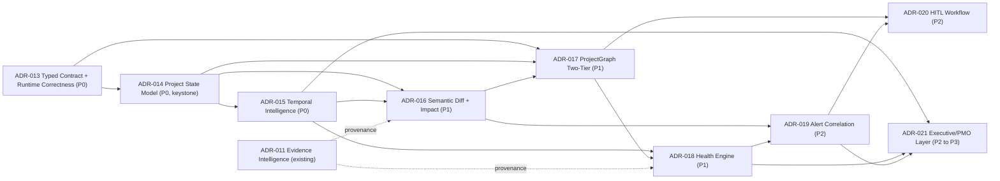
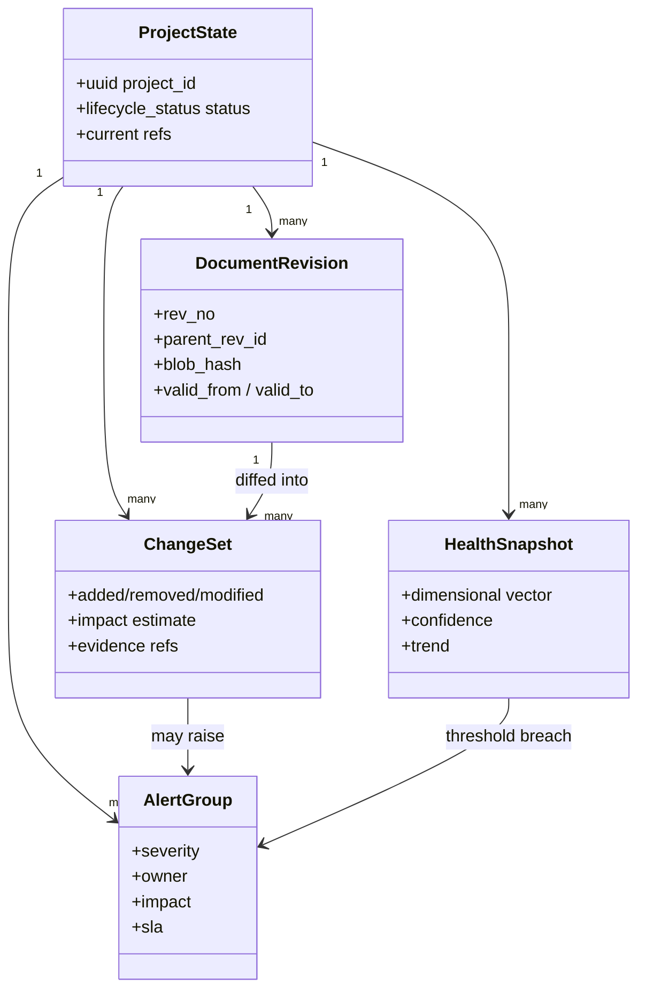
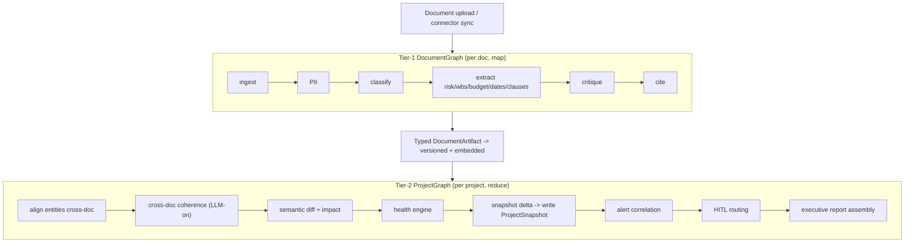

# C2Pro v3.0 — Architecture Decision Records & Build Blueprint

**Authors (role):** Chief Architect · Enterprise CTO · Principal Product Strategist · LangGraph Architect · Project Intelligence Platform Designer · Technical Program Director
**Date:** 2026-06-07
**Basis:** Four independent CONSENSUS OF CONSENSUSES reports, accepted as true. This is **not** an audit, review, or strategy paper — it is the implementation blueprint that converts settled consensus into buildable decisions.
**Mandate:** Transform C2Pro from a *Document/Contract Intelligence Platform* into an *AI-Native Project Intelligence Overlay* — **without a rewrite**, maximizing leverage on the existing strong foundation.

---

## 0. Numbering, scope, and reuse of existing work

**ADR series starts at ADR-013.** Your live repository already owns ADR-009 (honest coherence scoring / ECOA), ADR-010 (Evidence Maturity Layer), ADR-011 (Evidence Intelligence Layer — currently at Phase 2A.3), and ADR-012 (deferred). The example numbering in the brief collides with these; this blueprint uses **ADR-013 → ADR-021** so the records drop into the repo without conflict.

**These ADRs extend, not replace, existing investments:**
- **Evidence/provenance** is *already being built* in ADR-010/011. The v3.0 "provenance as hard invariant" requirement is satisfied by promoting ADR-011's evidence layer to a gate — not a new system. New ADRs consume `evidence_extraction_events`, `extraction_run_id`, and `lifecycle_status` rather than inventing parallel structures.
- **Honest scoring** (ADR-009) is the discipline reused verbatim by the Health Engine (ADR-018): never fabricate a green; distinguish `budget_exhausted` from `insufficient_evidence`.
- **Locked invariants honored throughout:** `lifecycle_status` as enum; `extraction_run_id` for atomic batch supersession; errors in a separate events table; **no `commit()` inside repositories**; canary rollout (10 % → 50 % → 100 % with metric gates) for any LLM-backed behavior change; "invariant by formula, adaptive by profile."

**The minimal ADR set is 9** (the brief's example list of 8 is close but conflates Change Intelligence with diffing and under-specifies the runtime/typing precondition). Determination below.

---

# PHASE 1 — ADR IDENTIFICATION (the minimal required set)

| ADR | Title | One-line decision |
|---|---|---|
| **013** | Typed Graph Contract & Runtime Correctness Baseline | Make the graph state typed and failure-honest before building on it. |
| **014** | Project State Model (Canonical Aggregate) | Introduce `ProjectState` as the primary aggregate; documents become inputs, not the unit of intelligence. |
| **015** | Temporal Intelligence Layer | Event log (change source-of-truth) + append-only `ProjectSnapshot` (materialized read model) + revision lineage. |
| **016** | Semantic Diff & Change-Impact Engine | Detect clause/entity-level deltas across revisions and propagate impact across dimensions; this is "Change Intelligence." |
| **017** | ProjectGraph Orchestration (Two-Tier) | DocumentGraph (map) → ProjectGraph (reduce); cross-document coherence runs live here. |
| **018** | Project Health Engine | Multi-dimensional, confidence-weighted health vector with honest nulls; Coherence demoted to a subscore. |
| **019** | Alert Correlation & Decision Engine | Convert many findings into few owned, impact-rated, escalatable decisions. |
| **020** | HITL Workflow System | Productize the interrupt seed into persona queues, approval chains, audit, and an active-learning loop. |
| **021** | Executive & PMO Intelligence Layer | Evidence-backed, confidence-rated reporting / Morning Briefing / portfolio rollup over snapshots. |

**Why "Change Intelligence" is not its own ADR:** it is the *composition* of ADR-016 (what changed) and the impact propagation that runs inside ADR-017 (what it conflicts with) writing to ADR-015 (the delta record). Making it a separate ADR would create an orphan with no distinct state of its own.

**Why ADR-013 exists at all:** the consensus names untyped `dict[str,Any]` state, silent `except: return []`, the coherence signature drift, and the `low_budget_mode` default as the runtime blockers. Typing the graph contract and making failure visible is a durable architectural decision that *everything else depends on* — it is not mere cleanup.

---

## ADR-013 — Typed Graph Contract & Runtime Correctness Baseline

**Problem.** The graph state is an untyped flat `dict[str,Any]`; nodes mix in-place mutation with partial-patch returns; pervasive `except Exception: return []` makes a crashed extractor indistinguishable from "0 findings"; the coherence node carries a signature drift (`seed_signals`/`seed_coverage`); and `low_budget_mode` defaults the headline feature into a degraded path. Building project-level synthesis on this substrate would compound the fragility.

**Decision.**
1. Replace `dict[str,Any]` channel values with **Pydantic v2 models** (`RiskItem`, `WbsActivity`, `BomItem`, `Citation`, `CoherenceFinding`, `DocumentArtifact`). Keep the `TypedDict` graph channels; type the *values*.
2. Introduce a uniform node return type:
   ```python
   class NodeResult(BaseModel):
       status: Literal["ok", "degraded", "failed"]
       data: list[BaseModel] = []
       error: ErrorRecord | None = None      # written to evidence_extraction_events, never swallowed
       confidence: float | None = None
   ```
   `degraded`/`failed` propagate as a **Documentation-health signal** (feeds ADR-018), never as silent empties.
3. Fix the coherence signature drift; add a contract test that fails CI on graph-node signature mismatch.
4. **Remove `low_budget_mode` as the default** on the project path (the toggle survives only as an explicit per-call cost ceiling, gated by decision-value not by default).

**Consequences.** (+) Eliminates false-confidence; unblocks safe refactors; gives the UI a "degraded vs clean" distinction. (−) One-time migration of ~node return sites; a short spike in surfaced "failures" that were previously hidden (this is a feature, not a regression). Honors *no `commit()` in repositories*.

**Dependencies.** None. **Priority: P0 (precondition for all others).**

---

## ADR-014 — Project State Model (Canonical Aggregate)

**Problem.** `ProjectState` is keyed on a single `document_id`; there is no representation of the *project* as an evolving entity. Cross-document reasoning is therefore homeless and exiled to an HTTP side-path.

**Decision.** Establish **`ProjectState` as the aggregate root** and the primary unit of intelligence. Documents and their revisions are *inputs* that mutate project entities through events.

**Primary unit of intelligence — the explicit answer:** **the Project, materialized as time-ordered Snapshots, derived from Events.** Not the Document (too local), not the Snapshot alone (a snapshot is a read model, not the source of truth), not the Event alone (events are the source of truth for *change* but you reason over the *current materialized state*). Formally: **Events are the write model; the current ProjectState + the Snapshot timeline are the read models.** The document remains the evidence anchor, never the unit of reasoning.

**Canonical entities (aggregate map):**
```
ProjectState (aggregate root)
├── DocumentRevision      (immutable; rev_no, parent_rev, blob_hash, parsed_at)   ← ADR-015
├── Clause / Obligation   (clause_id, text_span, lifecycle_status, source rev)
├── WbsActivity           (id, dates, %complete, baseline ref)
├── BudgetItem / BoqItem  (cost_code, committed, actual, source)
├── RiskItem              (severity, mitigation, aging, source)
├── Stakeholder / RaciCell
├── ChangeSet             (typed delta between revisions)                          ← ADR-016
├── HealthSnapshot        (dimensional vector + confidence)                        ← ADR-018
└── Decision / AlertGroup (owned, impact-rated)                                    ← ADR-019
```
**Lifecycle:** `draft → active → superseded → archived`, governed by `lifecycle_status` (reusing the ADR-011 enum) and atomic batch supersession via `extraction_run_id`. Every entity carries provenance `(document_revision_id, clause_id, char_span, confidence)` sourced from the Evidence layer (ADR-011).

**Consequences.** (+) Cross-dimension queries become native (Clause ↔ WBS ↔ Budget); the data model finally matches the product mission. (−) New canonical schema + repository ports; a one-time mapping from per-document outputs into project entities.

**Dependencies.** ADR-013 (typed contracts). **Priority: P0 (keystone).**

---

## ADR-015 — Temporal Intelligence Layer

**Problem.** "Version" is an integer counter. No revision lineage, no snapshot timeline, no event store ⇒ no trends, no early warning, no change-impact, no "what changed since last week."

**Decision — hybrid event-log + materialized snapshots (not full event sourcing of everything).**
- **Domain event log** as the source of truth for *change*: `DocumentVersionCreated`, `ClauseChanged`, `BudgetBaselineUpdated`, `ScheduleSnapshotIngested`, `RiskRaised`, `ChangeOrderSubmitted`, `HealthRecomputed`. Append-only, tenant-scoped (RLS), reusing the `evidence_extraction_events` pattern.
- **`ProjectSnapshot`** as an **append-only materialized read model** (the health/score/counts state at time *t*) — written on every analysis run and on a daily scheduled Celery task. Snapshots make trend/delta queries O(1) without replaying events.
- **Revision lineage:** `DocumentRevision(rev_no, parent_rev_id, blob_hash, valid_from, valid_to)` with content-addressed blob storage (you already hash on reupload — promote the hash to a durable revision row + R2 object, fixing the "amnesiac reset" the consensus identified).

```sql
CREATE TABLE project_snapshot (
  id uuid PRIMARY KEY,
  project_id uuid NOT NULL,
  captured_at timestamptz NOT NULL,
  health jsonb NOT NULL,            -- dimensional vector + confidence (ADR-018)
  coherence_score numeric,          -- now a subscore, nullable/honest
  open_risk_count int,
  totals jsonb,
  source_run_id uuid,               -- extraction_run_id provenance
  CONSTRAINT snapshot_append_only CHECK (true)
);  -- RLS: tenant_id fail-closed; never UPDATE, only INSERT
```

**Why hybrid over pure event sourcing:** full ES of every entity is high-complexity and the consensus explicitly warns against over-engineering. The change-relevant entities (revisions, clauses, costs, risks) get event provenance; the *answers* (health, trends) are cheap materialized snapshots. This is "invariant by formula, adaptive by profile" applied to time.

**Consequences.** (+) Unlocks diff, trends, early warning, change workflows, and forecasting later. (−) Snapshot table growth → add retention/partitioning policy from day one (the consensus flagged unbounded growth as a real-but-solvable risk).

**Dependencies.** ADR-014. **Priority: P0.**

---

## ADR-016 — Semantic Diff & Change-Impact Engine

**Problem.** Revisions aren't compared; the value in EPC is entirely in the delta ("what changed Rev C → Rev D"), and it doesn't exist as a first-class object. This is the **unowned wedge** every report names as the biggest opportunity.

**Decision.** A two-stage engine producing a typed `ChangeSet` plus an impact propagation.

**Change detection — must support contracts, schedules, budgets, RFIs, change orders:**
- **Structural diff** (deterministic, cheap, runs first): clause/row/line-item add / remove / modify keyed on stable anchors (clause_id, cost_code, activity_id). Handles schedules/budgets via keyed structural comparison — no LLM needed.
- **Semantic diff** (LLM, gated, runs on modified pairs only): classifies *meaning* of change (e.g., "penalty cap raised 5 %→10 %", "milestone pushed 12 days") and severity. Cost-controlled by only sending changed pairs, not whole documents.

**Impact calculation:** propagate each change across the entity graph (Clause → WBS → Budget → Obligation) and emit impact estimates with explicit confidence and an *honest null* when inputs are missing (no fabricated dollar figures). Impact = `{schedule_days?, cost_delta?, contractual_trigger?, affected_entities[], confidence, evidence[]}`.

**Evidence storage:** every `ChangeSet` and impact links to `evidence_extraction_events` (ADR-011) with `(rev_id, clause_id, char_span)` — provenance is a hard gate (a change with no evidence span is `unverified`, never shown as fact).

**Output — the Change-Impact Report:** the product's signature artifact. *"Addendum 3 raised LDs to 10 %; Activity A-120 slipped 12 days; the two now conflict within 5 days of the LD trigger. Est. exposure €X (confidence 0.6). Owner: Contract Manager."*

**Consequences.** (+) Converts "scores a document" into "watches a project"; the demo nobody else can give. (−) Anchor-resolution (matching entities across revisions) is the hard part — budget the engineering here.

**Dependencies.** ADR-014, ADR-015. **Priority: P1 (core differentiator).**

---

## ADR-017 — ProjectGraph Orchestration (Two-Tier)

**Problem.** The single LangGraph processes one document; cross-document coherence is starved and degraded. The orchestration *granularity* is wrong (the framework is fine).

**Decision — two-tier graph. Recommended over the alternatives:**

| Pattern | Verdict | Why |
|---|---|---|
| **Two-tier (DocumentGraph map → ProjectGraph reduce)** | **CHOSEN** | Lowest risk; reuses existing N1–N17 as Tier-1; uses LangGraph `Send()` for fan-out/reduce you already have primitives for; ships in 90 days. |
| Supervisor-Worker | Defer | Useful mid-term pattern but adds a routing agent layer before the temporal spine exists; premature. |
| Event-driven agent mesh | Defer (12 mo+) | Aspirational end-state; full rewrite risk; the consensus calls it 2+ years out. |
| Pure agent mesh | Reject near-term | Highest risk for a small team; no incremental path from current code. |

```
TIER 1 — DocumentGraph (per document; existing graph, trimmed + typed)
  ingest → PII → classify → extract(risk|wbs|budget|dates|obligations) → critique → cite
  OUTPUT: typed DocumentArtifact → persisted, versioned (ADR-015), embedded

TIER 2 — ProjectGraph (per project; runs on any artifact change — Celery already gives the trigger)
  load_current_artifacts(project)            # contract + schedule + budget + RFIs + COs
   → align_entities (cross-doc resolution: WBS↔BOQ↔activities↔clauses)
   → CROSS-DOC COHERENCE (the real one: 6 categories over multiple docs, LLM-on)
   → SEMANTIC DIFF + IMPACT (ADR-016)
   → HEALTH ENGINE (ADR-018)
   → DELTA vs previous ProjectSnapshot → write snapshot (ADR-015)
   → ALERT CORRELATION (ADR-019) → HITL routing (ADR-020)
   → executive report assembly (ADR-021)
```

**State model:** Tier-2 state is a small, typed `ProjectGraphState` (project_id, changed_artifact_ids, prior_snapshot_ref) — *not* the 40/70-field monster. Fan Tier-1 across changed docs with `Send()`, reduce in Tier-2.

**Consequences.** (+) Cross-document coherence finally lives in the hot path, LLM-on, gated by decision-value (a project re-score is worth a Sonnet call). (+) Tier-2 is small and typed, ending state explosion. (−) Two graphs to maintain; a clear contract (`DocumentArtifact`) between tiers is mandatory.

**Dependencies.** ADR-013, ADR-014; consumes ADR-016/018/019. **Priority: P1 (core).**

---

## ADR-018 — Project Health Engine

**Problem.** Coherence ≠ Health. The product can't answer "is this project on track?" — the only question buyers ask.

**Decision.** A **multi-dimensional, confidence-weighted Health Vector** with honest nulls. Coherence is demoted to one input of Contract health.

| Dimension | Inputs | Scoring logic (v1 pragmatic) | Confidence driver | Phase |
|---|---|---|---|---|
| Contract | obligations, clauses, **coherence subscore**, LDs, COs | obligations-met %, unresolved incoherence, exposure | clause coverage | **v0** |
| Risk | risk items, severity, mitigation, aging | weighted open-risk index + trend | extraction quality | **v0** |
| Documentation | ingestion coverage, parse success, `degraded`/`failed` node count (ADR-013) | % parsed cleanly; missing core docs | meta-signal | **v0** |
| Governance | HITL approvals, alert SLA breaches, audit completeness | overdue approvals; unactioned criticals | workflow coverage | **v0** |
| Schedule | activities, dates, %complete, baseline | SPI proxy = earned/planned duration; slip vs baseline | dated-activity coverage | **v1** (needs schedule ingest) |
| Cost | budget, committed, actuals, COs | CPI proxy = EV/AC; burn vs %complete | actuals presence | **v1** |
| Deliverables | WBS/scope vs progress | committed-vs-delivered ratio; overdue | scope completeness | **v1** |

**Composite** = confidence-weighted roll-up with explicit `insufficient_data` states. Every dimension returns `{score|null, confidence, evidence[], trend}`. **Honest-null discipline (reuse ADR-009):** distinguish `budget_exhausted` from `insufficient_evidence`; **never fabricate a green.** Thresholds adaptive by project profile ("invariant by formula, adaptive by profile").

**Why phased:** v0 dimensions are buildable from data you already extract — ship them in 30–90 days. v1 dimensions wait on schedule/cost ingestion (6 mo). This avoids fake precision.

**Consequences.** (+) The first real executive value; the number every persona wants. (−) Trust is fragile — a wrong green destroys an EPC relationship; the honest-null discipline is non-negotiable.

**Dependencies.** ADR-014, ADR-015; coherence input from ADR-017. **Priority: P1 (core).**

---

## ADR-019 — Alert Correlation & Decision Engine

**Problem.** Alerts are reactive, document-centric, uncorrelated, and impact-free. Ten document inconsistencies on the same milestone become ten alerts, not one decision.

**Decision.** Transform findings → **Decision objects** through correlation.
- **Correlation:** group findings by shared entity (milestone, clause, WBS node) and by causal chain ("schedule slip #42 → budget overrun #43") into one `AlertGroup`.
- **Prioritization:** rank by `severity × confidence × impact`; dedupe across re-runs; suppress unchanged alerts and alerts with a pending change order.
- **Decision object fields:** `severity, confidence, impact_estimate(€/days), affected_entities[], evidence[], recommended_action, owner, sla, escalation_path, requires_human_validation, correlation_group, status_audit_trail`.
- **Escalation:** SLA timers (reuse existing `SlaCalculator`); unacknowledged critical → auto-escalate up the role chain.

**Consequences.** (+) Alerts become accountable actions, killing information overload (the named adoption killer). (−) Correlation quality depends on entity resolution (ADR-016) being solid.

**Dependencies.** ADR-016 (impact), ADR-018 (health deltas). **Priority: P2 (differentiation).**

---

## ADR-020 — HITL Workflow System

**Problem.** HITL is a sound technical interrupt, not an enterprise workflow — no persona queues, no approval chains, no escalation, no learning loop.

**Decision.** Productize the existing `langgraph.interrupt` seed.
- **Persona queues:** Contract Manager (risk/clause extractions), Planner (WBS deltas), Cost Controller (budget changes), Executive (health sign-off). Confidence/impact routing already exists — make thresholds **per-tenant/per-doc-type policy**, not hardcoded `< 0.5`.
- **Approval chains:** configurable Creator → Reviewer → Approver per tenant/project/doc-type.
- **Escalation:** unactioned review → timed escalation (reuse `SlaCalculator`).
- **Audit trail:** every human action recorded with evidence link — dispute-grade.
- **Active-learning loop (the moat):** each human correction becomes a candidate **golden-corpus eval case** (wire `ai_feedback/` → the golden harness) and a few-shot example pushed to the vector store. Track AI-human alignment; re-evaluate when it drops below threshold.
- **Automation boundary:** auto-approve low-risk summarization/retrieval; **require human** for contractual risk classification, change-order impact, schedule-baseline changes, cost-exposure estimates, executive reporting.

**Consequences.** (+) Enterprise-grade trust + a compounding quality flywheel. (−) Queue/policy config surface; guard against the `except → interrupt` fallback burying reviewers (alert on the fallback path).

**Dependencies.** ADR-017 (graph routes here), ADR-019 (alerts to review). **Priority: P2 (differentiation).**

---

## ADR-021 — Executive & PMO Intelligence Layer

**Problem.** Executives and PMO leads need confidence-rated answers and portfolio rollups, not raw AI output or per-document coherence.

**Decision.** A thin **read layer over snapshots** (no new source-of-truth).
- **Morning Briefing digest** (email/Slack): what changed, new correlated alerts, health-trend deltas — the highest-ROI daily-adoption hook.
- **Executive health report:** one-glance project health vector + top exposures + forecast, every number evidence-backed and confidence-rated.
- **Portfolio/PMO rollup:** cross-project health matrix (red/amber/green) over `ProjectSnapshot` history; benchmarking later.

**Consequences.** (+) The enterprise buyer's first view; the retention hook. (−) Pure consumer of upstream quality — ships *after* health + alerts are trustworthy.

**Dependencies.** ADR-015, ADR-018, ADR-019. **Priority: P2 → P3 (briefing P2; portfolio P3).**

---

# PHASE 2 — ADR PRIORITIZATION

| ADR | Priority | Impact (1-10) | Complexity (1-10) | Strategic Importance (1-10) |
|---|---|---|---|---|
| 013 Typed Contract & Runtime Correctness | **P0 Foundation** | 9 | 3 | 10 |
| 014 Project State Model | **P0 Foundation** | 10 | 7 | 10 |
| 015 Temporal Intelligence Layer | **P0 Foundation** | 10 | 6 | 10 |
| 016 Semantic Diff & Change-Impact | **P1 Core** | 10 | 8 | 10 |
| 017 ProjectGraph (Two-Tier) | **P1 Core** | 10 | 8 | 10 |
| 018 Project Health Engine | **P1 Core** | 10 | 6 | 10 |
| 019 Alert Correlation & Decision | **P2 Differentiation** | 8 | 5 | 9 |
| 020 HITL Workflow System | **P2 Differentiation** | 8 | 6 | 8 |
| 021 Executive & PMO Layer | **P2→P3** | 8 | 5 | 8 |

---

# PHASE 3 — ARCHITECTURE DEPENDENCY MAP



**Must exist first (critical path):** `013 → 014 → 015 → 016 → 017`.
**Can be parallelized:** ADR-018 v0 (Risk/Contract/Docs/Governance) can proceed alongside ADR-016/017 using current data; ADR-020 (HITL extension) can be specced and policy-modeled in parallel; ADR-013 sub-tasks parallelize across nodes.
**Highest leverage:** **ADR-014 + ADR-015 (the keystone pair).** Every downstream capability — diff, health, alerts, reporting, forecasting — is structurally blocked without project state + time. ADR-013 is the precondition that makes work on them safe.

---

# PHASE 4–10 — Engine designs

Designs for ADR-014 (Project State Engine), ADR-015 (Temporal), ADR-016 (Semantic Diff), ADR-017 (ProjectGraph), ADR-018 (Health), ADR-019 (Alert Correlation), and ADR-020 (HITL) are specified in full in their ADR sections above, including the explicit answers the brief requests:

- **Primary unit of intelligence (Phase 4):** *Project, materialized as Snapshots, sourced from Events* — see ADR-014.
- **Temporal representation (Phase 5):** *hybrid event-log + materialized append-only snapshots + content-addressed revision lineage* — see ADR-015.
- **Semantic change detection / impact / evidence (Phase 6):** *deterministic structural diff → gated LLM semantic diff → graph impact propagation → evidence-gated ChangeSet* — see ADR-016.
- **ProjectGraph pattern (Phase 7):** *two-tier map/reduce, chosen over supervisor-worker / event mesh / agent mesh* — see ADR-017 (with the comparison table).
- **Health dimensions / scoring / confidence (Phase 8):** *7-dimension vector, v0/v1 phasing, honest nulls* — see ADR-018.
- **Alert correlation / prioritization / escalation / ownership (Phase 9):** *AlertGroup decision objects ranked by severity×confidence×impact* — see ADR-019.
- **HITL queues / approvals / escalations / audit / learning (Phase 10):** *persona queues + configurable chains + active-learning flywheel* — see ADR-020.

---

# PHASE 11 — v3.0 TARGET ARCHITECTURE

### Logical architecture
```
┌──────────────────────────────────────────────────────────────────────────┐
│  CONSUMPTION   Morning Briefing · Exec Health Report · Portfolio (ADR-021) │
│                Persona Workbenches + HITL Queues (ADR-020)                  │
├──────────────────────────────────────────────────────────────────────────┤
│  INTELLIGENCE  ProjectGraph Tier-2 (ADR-017): cross-doc coherence,         │
│                semantic diff+impact (ADR-016), health (ADR-018),           │
│                alert correlation (ADR-019)                                  │
├──────────────────────────────────────────────────────────────────────────┤
│  TEMPORAL      Event log + append-only ProjectSnapshot + revision lineage   │
│                (ADR-015)                                                    │
├──────────────────────────────────────────────────────────────────────────┤
│  STATE         ProjectState aggregate + canonical entities (ADR-014)        │
│                Evidence/provenance layer (ADR-011, existing) ── hard gate    │
├──────────────────────────────────────────────────────────────────────────┤
│  EXTRACTION    DocumentGraph Tier-1 (existing N1–N17, typed) (ADR-013/017)  │
├──────────────────────────────────────────────────────────────────────────┤
│  INGESTION     PDF/Excel/BC3 parsers · passive connectors (P6/SharePoint)   │
├──────────────────────────────────────────────────────────────────────────┤
│  PLATFORM (unchanged)  FastAPI · Celery/DLQ · Postgres+pgvector+RLS · R2 ·  │
│                        Clerk · LangGraph checkpointer · LangSmith            │
└──────────────────────────────────────────────────────────────────────────┘
```

### Domain architecture


### AI architecture (two-tier graph)


### Product architecture (persona → surface → engine)
```
Contract Manager ─► Change-Impact Workbench ─────► ADR-016 + ADR-020
Project Manager  ─► Health + "Today" action queue ► ADR-018 + ADR-019
Planner          ─► WBS delta review ────────────► ADR-016 + ADR-020
Executive        ─► Morning Briefing + Health ───► ADR-021
PMO Lead         ─► Portfolio rollup ────────────► ADR-021 (P3)
```

---

# PHASE 12 — IMPLEMENTATION ROADMAP

### 30 days — Foundation & stop the bleeding *(ADR-013, start 014)*
- Fix coherence signature drift; remove `low_budget_mode` default; CI signature-contract test. **Milestone:** runtime green.
- Introduce `NodeResult`; route `degraded`/`failed` to evidence events + Documentation-health signal. **Milestone:** no silent empties.
- Type the highest-traffic state values (Risk, WbsActivity, BudgetItem, Citation). 
- Approve the `ProjectState` spec + canonical entity schema. **Milestone:** ADR-014 spec signed.
- Repo hygiene + secret-scan (parallel, low-cost). 
- *Risk mitigation:* surfaced "new" failures are previously hidden ones — communicate this to avoid false-alarm.

### 90 days — Temporal spine + the wedge *(ADR-014, 015, 016, start 017, 018-v0)*
- Ship `ProjectState` aggregate + repositories (no `commit()` in repos). 
- Ship `DocumentRevision` (content-addressed blobs) + append-only `ProjectSnapshot` + event log, with retention policy. **Milestone:** every upload = durable comparable revision; every run writes a snapshot.
- Ship structural + gated semantic diff → first **Change-Impact Report**. **Milestone:** a revision produces an evidence-cited ChangeSet with cross-doc conflict.
- Stand up ProjectGraph Tier-2 skeleton; move cross-doc coherence to the live path, LLM-on. **Milestone:** headline feature true in the hot path.
- Health Engine **v0** (Risk/Contract/Documentation/Governance, honest nulls) on the dashboard. **Milestone:** confidence-rated health vector renders.
- *Risk mitigation:* canary the live-coherence change 10 %→50 %→100 % with metric gates (your ADR-009 pattern).

### 180 days — Daily tool *(ADR-019, 020, 018-v1 start, Briefing)*
- Alert correlation → Decision objects (owner/impact/SLA/dedupe). 
- Persona HITL queues + configurable chains + escalation; wire corrections → golden corpus. **Milestone:** Contract-Manager change-impact loop used daily by one real user.
- Morning Briefing digest (the adoption hook). 
- Schedule/cost baseline ingestion (P6 XER/XML, MSP, hardened Excel) → unlock Health **v1** Schedule/Cost/Deliverables. 
- Change-Order + RFI as first-class objects. 
- *Risk mitigation:* land one paid EPC pilot now — product decisions need a real user in the room.

### 365 days — Platform & intelligence *(ADR-021 portfolio, forecasting)*
- Portfolio/PMO rollup over snapshot history. 
- Predictive forecasting (completion date, cost-at-completion) on ≥6 months of snapshots. 
- Passive connectors hardened; enterprise SSO/RBAC/audit/compliance. 
- Active-learning loop matured; cross-project benchmarking. 
- *Explicitly NOT built:* BIM/IFC, mobile field app, dedicated graph DB, NL rules engine, scheduling/system-of-record engine. (5/6 consensus: premature; they dilute the wedge.)

---

# PHASE 13 — CTO MEMO: first 10 implementation decisions (ranked)

1. **Freeze new-module scope; ratify the two-tier ProjectGraph + temporal spine as the v3.0 architecture.** *Why:* sprawl, not capability, is the binding constraint; this is a leadership decision executable today.
2. **Land ADR-013 (typed contract + runtime correctness) before any feature work.** *Why:* you cannot safely build project synthesis on untyped state and silent failures; it's a one-time, low-complexity, high-leverage unblock.
3. **Sign the ADR-014 `ProjectState` spec as the canonical model.** *Why:* the keystone; every downstream engine references it. Get the entity boundaries right once.
4. **Build the ADR-015 temporal spine (revisions + snapshots + events) with retention from day one.** *Why:* unlocks 60 % of the roadmap; the "amnesiac reset" is the disqualifying gap.
5. **Ship ADR-016 semantic diff → Change-Impact Report as the flagship.** *Why:* the unowned wedge; the demo no incumbent can give; converts the product identity.
6. **Move cross-document coherence to the live ADR-017 path, LLM-on, canaried.** *Why:* the headline feature is currently vapor; this makes it real without a rewrite.
7. **Ship ADR-018 Health v0 on existing data with honest nulls.** *Why:* answers the only question buyers ask; reuses ADR-009 discipline; 30–90 day win.
8. **Make ADR-011 provenance a hard gate everywhere (no evidence span → unverified).** *Why:* trust is the moat for an evidence product; you've already built the substrate — promote it.
9. **Define the Contract-Manager daily loop as the v3.0 launch milestone (ADR-019 + ADR-020).** *Why:* the only viable daily persona; every sprint must move a real CM closer to daily use.
10. **Sign one paid EPC pilot now.** *Why:* the largest risk is building a world-class solution to a problem no one buys; a real user in the room is the cheapest insurance.

---

## Closing

This blueprint adds **nine ADRs (013–021)** that sit *on top of* the strong foundation and the in-flight Evidence Intelligence work — no rewrite, maximum reuse. The critical path is short and unambiguous: **type the contract, model the project, give it time, diff the changes, synthesize in a project graph, score health, correlate alerts, productize the human, then report.** Build the spine — *state, time, change, health* — in that order, hold the scope freeze, and C2Pro v3.0 becomes the AI-Native Project Intelligence Overlay the entire consensus says the market is waiting for.