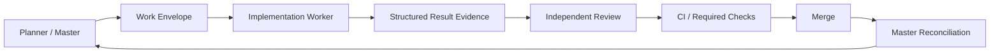

# C2Pro Development Orchestration Guide

**Version:** 2.0.0  
**Last Updated:** 2026-10-01  
**Status:** Current  
**Canonical machine control:** `.c2pro/control/`

This guide describes the current development-agent control model. It supersedes the 2026-04 blackboard/backlog orchestration model for modern `C2PRO-*` work.

## 1. Core model

C2Pro uses **dual-read / single-write-new-control** compatibility:

- `.c2pro/control/` — canonical hot control/policy.
- `.c2pro/work/<work_id>.yaml` — bounded assigned work.
- `.c2pro/handoff/` / Git/PR/CI evidence — continuation and proof where defined.
- `C2PRO_MASTER_BACKLOG.md`, `backlogs/*.md`, `blackboard.json` — legacy/cold reconciliation sources only.

Ordinary workers do not update legacy state.

## 2. Identities are separate

```text
Role != Worker != Model/Provider != Harness/Surface
```

Canonical routing is `.c2pro/control/routing.yaml`.

A role describes the function required by the work. A worker/model route is replaceable and must satisfy current eligibility/qualification policy.

## 3. Current worker classes

Read `.c2pro/control/routing.yaml` for exact current values.

At the 2026-10-01 reconciliation baseline:

- principal workers: Claude Code, Codex;
- subordinate/specialist surfaces: Gemini CLI, Antigravity, OpenCode;
- subordinate output cannot satisfy a required principal-review gate.

This table is descriptive and must not be treated as more authoritative than routing YAML.

## 4. Work lifecycle



### 4.1 Planner / Master

Owns canonical development-control mutation.

Responsibilities include:

- choose/authorize work;
- seal scope and base SHA;
- assign role/routing under policy;
- reconcile worker/reviewer/CI/merge evidence;
- keep completed work out of hot queue when the control schema requires it.

### 4.2 Worker

Receives a bounded `.c2pro/work/` envelope.

Must preserve:

- work ID;
- base SHA;
- scope/out-of-scope;
- acceptance criteria;
- required tests/checks;
- forbidden paths/authority constraints.

Returns `c2pro-implementation-result-v1` evidence. It does not mutate legacy task registers.

### 4.3 Reviewer / challenger

Review requirements come from `.c2pro/control/review-policy.yaml`.

Important invariants:

- material self-approval forbidden;
- principal reviewer differs from implementation worker when required;
- architecture/security/high-blast-radius work uses stronger review;
- challenger is directed failure-mode/alternative analysis, not endless debate;
- unresolved material disagreement escalates.

### 4.4 Reconciler

The Planner/Master reconciliation step is the single writer for development control.

Worker evidence alone is not completion. Review, applicable CI and merge evidence must be reconciled according to the active control schema/policy.

## 5. Workspace lifecycle

Canonical policy: `.c2pro/control/workspace-policy.yaml`.

Workers validate their assigned workspace but do not independently create/remove/reset/clean/repurpose controlled workspaces unless explicitly authorized.

Workspace mismatch fails closed.

## 6. CI gate classification

Required checks must be discovered from the live target-branch ruleset plus package-specific gates.

Signals should be classified as:

- `REQUIRED_GATE`;
- `ADVISORY_CHECK`;
- `OBSERVABILITY_SIGNAL`.

Rules:

- evaluate the exact sealed head SHA/current run attempt;
- pending is not failure;
- an earlier green attempt does not qualify a later head;
- advisory provider limits do not become required failures unless policy says so;
- never weaken CI/security policy to manufacture green.

## 7. Product lifecycle is separate

Development completion and product lifecycle promotion are different control planes.

Product programme/lifecycle authority:

`validation/product/c2pro-master-product-control-v1.yaml`

A merged implementation may still be:

- not deployed;
- not production-qualified;
- not promoted in Product Control.

Qualification evidence does not autonomously promote lifecycle state.

## 8. Legacy supervisor boundary

`core/supervisor.py` and blackboard/backlog tooling remain compatibility surfaces for genuine legacy work.

Under the current transition policy:

- modern `C2PRO-*` work belongs to the new control plane;
- legacy machinery must not silently take ownership of modern work;
- where the compatibility contract requires it, modern work presented to legacy supervisor stops/hands off rather than broadening authority.

See `.c2pro/control/legacy-compatibility.yaml`.

## 9. Documentation changes discovered during development

Do not create a new task-status Markdown file.

Route durable knowledge by type:

- architecture decision → ADR;
- platform-wide design → TDD;
- durable contract → spec/product doc;
- operator procedure → runbook;
- development work state → `.c2pro`;
- product lifecycle → Product Control;
- historical evidence → immutable dated evidence.

## 10. Minimal worker result

The exact schema is authoritative, but a completion result carries at least the current work identity and verifiable evidence, such as:

```yaml
schema: c2pro-implementation-result-v1
work_id: C2PRO-DEV-XX
base_sha: <40-hex>
head_sha: <40-hex>
branch: <branch>
files_changed:
  - <path>
tests:
  - name: <check>
    status: PASS
ci_status: success
findings: []
residual_risks: []
recommendation: approve
pr_url: <url-or-null>
```

Do not copy this example over a newer machine schema if the schema evolves.

## 11. Authority references

- `.c2pro/control/current.yaml`
- `.c2pro/control/routing.yaml`
- `.c2pro/control/review-policy.yaml`
- `.c2pro/control/workspace-policy.yaml`
- `.c2pro/control/legacy-compatibility.yaml`
- `.claude/rules/CRITICAL_BACKLOG_REQUIREMENT.md`
- `agents.md`
- `docs/MASTER_DEVELOPMENT_STATUS.md`
